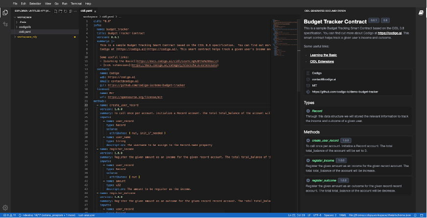

# Web-based IDE

## Getting Started with Código Studio: A web-based development environment
Welcome to our guide on how to use Código Studio, our web-based development environment. Código Studio provides comprehensive tools and programs for developers to create projects using our Código Interface Description Language, CIDL for short.

Whether an experienced developer or just starting, Código Studio makes writing, debugging, and testing your code in one central location easy. In this guide, we'll provide step-by-step instructions on how to get started with Código Studio and begin developing with CIDL.

Open **[Código Studio](https://studio.codigo.ai)**

## Código Studio in Action
Código Studio is built on the foundation of Visual Studio Code, a popular desktop code editor many developers use. As a result, if you have experience using VSCode, you'll find that the web-based environment of Código Studio will feel familiar and intuitive.

|  |
| :-------------------------------------------------: |
|                 *Codigo Studio Interface*           |

Código Studio comprises several main sections that provide different functionalities to developers. These sections include:
- **Editor**: This is the main area where developers write and edit their code. The editor is highly customizable and supports a wide range of programming languages.
- **Sidebar**: The sidebar provides quick access to different features and functionalities of Código Studio, including file explorer, search, source control, debugging, and extensions.
- **Status Bar**: The status bar displays information about the current file being edited, such as the programming language, indentation, and file encoding. It provides access to various features and settings, such as language mode and line-ending format.
- **Command Palette**: The command palette allows developers to execute commands and perform tasks within Código Studio, such as opening files, running tasks, and installing extensions.
- **Settings**: Código Studio allows developers to customize various settings and preferences to tailor their development experience to their specific needs and preferences.
- **Web-based documentation**: Código Studio provides a web-based documentation extension that allows developers better understand and collaborate with the CIDL. The documentation is generated in real-time based on the CIDL content.

By leveraging these different sections and their functionalities, developers can efficiently and effectively write, debug, and test their code using Código Studio.

## Available tools and programs
Código Studio provides a comprehensive set of tools and programs for developers to create projects using our CIDL; these tools are:

### Cargo CLI
The Cargo CLI is a command-line interface tool used for managing Rust projects. It is Rust's official build tool and package manager, making it easy for developers to create, build, and manage Rust projects.

For now, the commands that we are going to use are:

- `cargo build-sbf` With this command, we are going to build our Solana Contracts

You can learn more about Cargo CLI by clicking **[here](https://doc.rust-lang.org/cargo/commands/index.html)**

### Solana CLI

The Solana CLI (Command Line Interface) is a set of command-line tools used to interact with the Solana blockchain. It lets you create a wallet, send and receive SOL tokens, and participate in the cluster by delegating stake. The CLI provides a simple and efficient way to get started with Solana.

For now the commands that we are going to use are:

- `solana program deploy path/to/your_solana_contract.so` with this command you are able to deploy the solana program to a validator.
- `solana address` - Returns your public key.
- `solana config get` - Allows you to get information about the Solana CLI, like the RPC URL, where the Key pair is located, etc.

You can learn more about Solana CLI by clicking **[here](https://docs.solana.com/cli/conventions)**

:::note

The Solana CLI RPC URL comes preconfigured to: http://127.0.0.1:8899

:::

### Codigo CLI

The Codigo CLI is a powerful command-line tool used for managing CIDL files. With it, you can easily generate Solana contracts and TypeScript clients

The available commands are:

- `codigo generate path/to/your_cidl.yaml` with this command you can generate the Solana Contract and TypeScript Client. 

You can learn more about Codigo CLI by clicking **[here](Link to CODIGO CLI doc part here)**

### Others programs and Tools

The Codigo Studio environment comes with additional tools and programs to get you started working with the CIDL. These are:

- The **Node CLI** is a tool that allows you to run JavaScript code outside of a web browser. It's essential for creating and testing server-side applications, build scripts, and other JavaScript projects in a command-line environment.
- The **Git CLI** is a tool for managing and tracking changes to your codebase. With Git, you can create and maintain code branches, collaborate with others, and track changes over time.

## Next Steps

**Congratulations!** 🎉👏 at this point, you should have a basic understanding of the available tools that Código Studio comes with. To summarize what we learned:

- Código Studio comes with Cargo, Solana, and Codigo CLI
- Código Studio is based on the Visual Studio Code editor
- Código Studio comes with a web-based documentation extension 

These links may help you on your journey to writing smart contracts with the CIDL:

- [Learning the Basics](#)
- [Building Solana Programs with CIDL: A Comprehensive Guide Part I](#)
