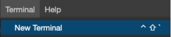
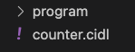
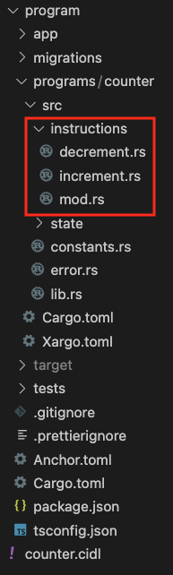

# Solana Anchor

In this Quickstart guide, you’ll learn how to start with Código’s Interface Description Language (CIDL) from scratch
using our web-based IDE, [Código Studio](https://studio.codigo.ai). Código Studio has all the necessary tools and
programs to develop using the CIDL. The CIDL is the file used as input to Código's AI generators.

:::note
In this Quickstart we will generate content for Solana Anchor. If you want the same guide for
Native check the [Solana Native Quickstart](./quickstart-solana-native.md)
:::

**Let’s get started!**

## 1. Write the CIDL

1. Open [Código Studio](https://studio.codigo.ai)
2. Create a new file name `counter.cidl`
3. Copy and paste the following CIDL code into the `counter.cidl` file you created

```yaml showLineNumbers
cidl: "0.9"
info:
  name: counter
  title: Counter
  version: 0.0.1
  license:
    name: Unlicense
    identifier: Unlicense
types:
  GreetingAccount:
    fields:
      - name: counter
        type: u32
methods:
  - name: increment
    inputs:
      - name: greeting_account
        type: sol:account<GreetingAccount>
        attributes: [ sol:writable, sol:init_if_needed]
  - name: decrement
    inputs:
      - name: greeting_account
        type: sol:account<GreetingAccount>
        attributes: [ sol:writable, sol:init_if_needed]
```

The CIDL is composed of a few top-level objects. In the counter CIDL we can see the `info`, `types`, and `methods`
objects.

- In the `info` object we can define the program metadata i.e. name, version, description, license, and more. Check the
  info section to [learn more](../learning-the-basics/info.md)
- In the `types` object we can define our program's custom types. Check the custom types section to
  [learn more](../learning-the-basics/custom-types.md)
- In the `methods` object we can define our program instructions, these are the instructions that will be called
  from the client or from other programs. Check the methods section to [learn more](../learning-the-basics/methods.md)

## 2. Generate code

With the CIDL completed, we can generate the smart contract and TypeScript
client library. For that, open a new terminal; Terminal -> New Terminal

|  |
|:---------------------------------------------------------------:|
|                         *New Terminal*                          |

Type the following command to execute the generator:

```shell
codigo solana generate cidl.yaml --anchor
```

:::tip
The `--anchor` flag can be abbreviated with the `-a` flag
:::

When it completes generating the code, you will see one new directory in the explorer as follows:

|  |
|:--------------------------------------------------------------------:|
|                            *Directories*                             |

- `program` this directory contains all the files for an Anchor solana program and the stubs where we will implement
  the business logic.

## 3. Implement the business logic

When we expand the `program` directory, we will see numerous files corresponding to an Anchor solana program; we
don’t need to change anything on these files; thus, we can ignore them. The files we are interested in and where we will
implement the business logic are inside the `programs/counter/src/instructions` directory.

:::tip
The `counter` directory name will change based on the CIDL name property
:::

|  |
|:---------------------------------------------------------------------------:|
|                              *Stub Directory*                               |

If we open one of those files, we will see a function named `handler`. Each file corresponds to a method
defined in the CIDL. Inside each file, we can see a function where we will be implementing the business logic, the
parameters of the function are determined by the inputs defined for the method in the CIDL.

### 3.1 Implement `increment`

Open the file `programs/counter/src/instructions/increment.rs` and replace the comment<br />`// Implement your business logic here...`
with the following line:

```rust showLineNumbers
/// Accounts:
/// 0. `[writable, signer]` fee_payer: [AccountInfo] Auto-generated, default fee payer
/// 1. `[writable, signer]` greeting_account: [GreetingAccount] 
/// 2. `[]` system_program: [AccountInfo] Auto-generated, for account initialization
pub fn handler(
  ctx: Context<Increment>,
) -> Result<()> {
  ctx.accounts.greeting_account.counter += 1;
    
  Ok(())
}
```

### 3.2 Implement `decrement`

Open the file `programs/counter/src/instructions/decrement.rs` and replace the comment<br />`// Implement your business logic here...`
with the following line:

```rust showLineNumbers
/// Accounts:
/// 0. `[writable, signer]` fee_payer: [AccountInfo] Auto-generated, default fee payer
/// 1. `[writable, signer]` greeting_account: [GreetingAccount] 
/// 2. `[]` system_program: [AccountInfo] Auto-generated, for account initialization
pub fn handler(
  ctx: Context<Decrement>,
) -> Result<()> {
  ctx.accounts.greeting_account.counter -= 1;
    
  Ok(())
}
```

## 4. Build and deploy

Código Studio comes with all the tools and programs for building and deploying solana programs.

First, let’s build the program. Open a new terminal by going to `Terminal -> New Terminal`. Navigate to the `program`
directory by typing the command `cd program`, and inside the `program` directory, type the following command:

```shell
anchor build
```

This command will take a few seconds to complete. When the previous command completes, open another terminal by going to
`Terminal -> New Terminal`. In the new terminal, type the command:

```shell
solana-test-validator
```

This command will start a solana validator to where we will be able to deploy the program. Keep the terminal open so
the validator continues running. Finally, return to the terminal where you built the program and type the command:

```shell
anchor deploy
```

This command will deploy the built program to the local solana validator we ran in the previous step. When the command
completes, it will return the _Program Id_ of the program and save it for later.

## 5. Integrate the client

Wow! We have built and deployed an Anchor solana program using in just a few minutes. The last step is to call this
program from our application. For this QuickStart, our application will be an integration test.

In the `test` directory, there will be a file named `counter.ts`, copy and paste the following code into it:

:::tip
Copy and paste your program ID in line 10 of the app.ts file.
:::

:::tip
The `counter.ts` name will change based on the CIDL name property
:::


```typescript showLineNumbers
import { AnchorProvider, BN, setProvider, web3 } from "@coral-xyz/anchor";
import * as counterClient from "../app/program_client";
import chai from "chai";
import { expect } from "chai";
import chaiAsPromised from "chai-as-promised";
import NodeWallet from "@coral-xyz/anchor/dist/cjs/nodewallet";
chai.use(chaiAsPromised);

// TODO: Specify the program Id we saved from when we deploy it
const programId = new web3.PublicKey("PASTE_YOUR_PROGRAM_ID");
counterClient.initializeClient(programId);

describe("counter tests", () => {
  // Configure the client to use the local cluster
  const provider = AnchorProvider.env();
  setProvider(provider);

  const systemWallet = (provider.wallet as NodeWallet).payer;
  const greetingAccount = web3.Keypair.generate();

  it("Test increment", async () => {
    await counterClient.incrementSendAndConfirm({
      signers: {
        feePayer: systemWallet,
        greetingAccount
      }
    });
    const account = await counterClient.getGreetingAccount(greetingAccount.publicKey);
    expect(account.counter).to.equal(1);
  });

  it("Test decrement", async () => {
    await counterClient.decrementSendAndConfirm({
      signers: {
        feePayer: systemWallet,
        greetingAccount
      }
    });
    const account = await counterClient.getGreetingAccount(greetingAccount.publicKey);
    expect(account.counter).to.equal(0);
  });
});
```

Finally, execute the test. Open a new terminal by going to `Terminal -> New Terminal`.
Navigate to the `program` directory `cd program`; Finally, execute the test using the following command:

```shell
anchor test --skip-build --skip-deploy --skip-local-validator
```
:::tip
Because we are using anchor we can skip the build and deployment steps by
only executing the command `anchor test`
:::

If everything went Ok, you should see the following output:

```shell
✔ Test increment
✔ Test decrement

2 passing
``` 

## 6. Next steps

**Congratulations!** 🎉👏 you just created your first Solana program using the CIDL and integrated the generated
TypeScript client library with an application. To summarize what we learned:

- CIDL stands for Código Interface Description Language, and it is the input for Código’s AI Generator.
- After completing the CIDL, developers only need to implement the business logic of the program.
- 100% of the client libraries and program boilerplate are generated.
- Código Studio has all the tools and programs to develop Solana programs using the CIDL.

These links may help you on your journey to writing Solana programs with the CIDL:

- [Overview](../index.md)
- [Learning the Basics](../learning-the-basics)
- [Build and informal lender program](../guides/lender.md)

## Join the Código community 💚

Código is a growing community of developers. Join us on
**[Discord](https://discord.gg/8XHQGS832k)**
and **[GitHub](https://github.com/Codigo-io)**
