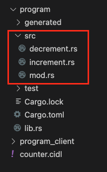

# Native Program

In this Quickstart guide, you’ll learn how to start with Código’s Interface Description Language (CIDL) from scratch
using our web-based IDE, [Código Studio](https://studio.codigo.ai). Código Studio has all the necessary tools and
programs to develop using the CIDL. The CIDL is the file used as input to Código's AI generators.

:::note
In this Quickstart we will generate content for Solana Native. If you want the same guide for
Anchor check the [Solana Anchor Quickstart](./quickstart-solana-anchor.md)
:::

**Let’s get started!**

## 1. Write the CIDL

1. Open [Código Studio](https://studio.codigo.ai)
2. Create a new file name `counter.cidl`
3. Copy and paste the following CIDL code into the `counter.cidl` file you created

```yaml showLineNumbers
cidl: "0.9"
info:
  name: counter
  title: Counter
  version: 0.0.1
  license:
    name: Unlicense
    identifier: Unlicense
types:
  GreetingAccount:
    fields:
      - name: counter
        type: u32
methods:
  - name: increment
    inputs:
      - name: greeting_account
        type: sol:account<GreetingAccount>
        attributes: [ sol:writable, sol:init_if_needed]
  - name: decrement
    inputs:
      - name: greeting_account
        type: sol:account<GreetingAccount>
        attributes: [ sol:writable, sol:init_if_needed]
```

The CIDL is composed of a few top-level objects. In the counter CIDL we can see the `info`, `types`, and `methods`
objects.

- In the `info` object we can define the program metadata i.e. name, version, description, license, and more. Check the
  info section to [learn more](../learning-the-basics/info.md)
- In the `types` object we can define our program's custom types. Check the custom types section to
  [learn more](../learning-the-basics/custom-types.md)
- In the `methods` object we can define our program instructions, these are the instructions that will be called
  from the client or from other programs. Check the methods section to [learn more](../learning-the-basics/methods.mdx)

## 2. Generate code

With the CIDL completed, we can generate the smart contract and TypeScript
client library. For that, open a new terminal; Terminal -> New Terminal

|  |
|:---------------------------------------------------------------:|
|                         *New Terminal*                          |

Type the following command to execute the generator:

```shell
codigo solana generate cidl.yaml
```

When it completes generating the code, you will see two new directories in the explorer as follows:

|  |
|:-------------------------------------------------------------:|
|                         *Directories*                         |

- `program` this directory contains all the files for a native solana program and the stubs where we will implement
  the business logic.
- `program_client` this directory will contain all the files for the TypeScript client library.

## 3. Implement the business logic

When we expand the `program` directory, we will see numerous files corresponding to a native solana program; we
don’t need to change anything on these files; thus, we can ignore them. The files we are interested in and where we will
implement the business logic are inside the `src` directory.

|  |
|:--------------------------------------------------------------------:|
|                           *Stub Directory*                           |

If we open one of those files, we will see a function with the same name as the file. Each file corresponds to a method
defined in the CIDL. Inside each file, we can see a function where we will be implementing the business logic, the
parameters of the function are determined by the inputs defined for the method in the CIDL.

### 3.1 Implement `increment`

Open the file `program/src/increment.rs` and replace the comment<br />`// Implement your business logic here...`
with the following line:

```rust showLineNumbers
/// Accounts:
/// 0. `[writable, signer]` fee_payer: [AccountInfo] Auto-generated, default fee payer
/// 1. `[writable, signer]` greeting_account: [GreetingAccount] 
/// 2. `[]` system_program: [AccountInfo] Auto-generated, for account initialization
pub fn increment(
  _program_id: &Pubkey,
  greeting_account: &mut Account<GreetingAccount>,
) -> ProgramResult {
  greeting_account.data.counter += 1;

  Ok(())
}
```

### 3.2 Implement `decrement`

Open the file `program/src/decrement.rs` and replace the comment<br />`// Implement your business logic here...`
with the following line:

```rust showLineNumbers
/// Accounts:
/// 0. `[writable, signer]` fee_payer: [AccountInfo] Auto-generated, default fee payer
/// 1. `[writable, signer]` greeting_account: [GreetingAccount] 
/// 2. `[]` system_program: [AccountInfo] Auto-generated, for account initialization
pub fn decrement(
  _program_id: &Pubkey,
  greeting_account: &mut Account<GreetingAccount>,
) -> ProgramResult {
  greeting_account.data.counter -= 1;

  Ok(())
}
```

## 4. Build and deploy

Código Studio comes with all the tools and programs for building and deploying solana programs.

First, let’s build the program. Open a new terminal by going to `Terminal -> New Terminal`. Navigate to the `program`
directory by typing the command `cd program`, and inside the `program` directory, type the following command:

```shell
cargo build-sbf
```

This command will take a few seconds to complete. When the previous command completes, open another terminal by going to
`Terminal -> New Terminal`. In the new terminal, type the command:

```shell
solana-test-validator
```

This command will start a solana validator to where we will be able to deploy the program. Keep the terminal open so
the validator continues running. Finally, return to the terminal where you built the program and type the command:

```shell
solana program deploy target/deploy/counter.so
```

This command will deploy the built program to the local solana validator we ran in the previous step. When the command
completes, it will return the _Program Id_ of the program and save it for later.

## 5. Integrate the client

Wow! We have built and deployed a Solana program in just a few minutes. The last step is to call this program
from our application. For this QuickStart, our application will be a command line interface.

Create a new file inside the `program_client` directory named `app.ts`. The file's content is the following:

:::tip
Copy and paste your program ID in line 9 of the app.ts file.
:::

```typescript showLineNumbers
import {decrementSendAndConfirm, getGreetingAccount, incrementSendAndConfirm, initializeClient} from "./index";
import {Connection, Keypair, PublicKey} from "@solana/web3.js";
import * as fs from "fs/promises";
import * as path from "path";
import * as os from "os";

async function main(feePayer: Keypair) {
  // TODO: Specify the program Id we saved from when we deploy it
  const progId = new PublicKey("PASTE_YOUR_PROGRAM_ID");

  // Create a new Solana connection
  const connection = new Connection("http://127.0.0.1:8899", {
    commitment: "confirmed"
  });

  initializeClient(progId, connection);

  // 0. Create keypair for the Greeting account
  const greetingAccount = Keypair.generate();

  // 1. Increment the counter by 1
  await incrementSendAndConfirm({
    signers: {
      feePayer,
      greetingAccount
    }
  });
  let account = await getGreetingAccount(greetingAccount.publicKey);
  console.info(account);

  // 2. Decrement the count by 1
  await decrementSendAndConfirm({
    signers: {
      feePayer,
      greetingAccount
    }
  });
  account = await getGreetingAccount(greetingAccount.publicKey);
  console.info(account);
}

fs.readFile(path.join(os.homedir(), ".config/solana/id.json"))
        .then(file => main(Keypair.fromSecretKey(new Uint8Array(JSON.parse(file.toString())))));
```

Finally, execute the `app.ts` file. Open a new terminal by going to `Terminal -> New Terminal`. Navigate to the sdk
directory `cd program_client`; install the node dependencies executing the command `npm install`, and install the dev
dependency ts-node executing the command `npm install --save-dev ts-node`. Finally, execute the file using the following command:

```shell
npx ts-node app.ts
```

If everything went Ok, you should see the following output:

```shell
{ counter: 1 }
{ counter: 0 }
``` 

## 6. Next steps

**Congratulations!** 🎉👏 you just created your first Solana program using the CIDL and integrated the generated
TypeScript client library with an application. To summarize what we learned:

- CIDL stands for Código Interface Description Language, and it is the input for Código’s AI Generator.
- After completing the CIDL, developers only need to implement the business logic of the program.
- 100% of the client libraries and program boilerplate are generated.
- Código Studio has all the tools and programs to develop Solana programs using the CIDL.

These links may help you on your journey to writing Solana programs with the CIDL:

- [Overview](/)
- [Learning the Basics](../learning-the-basics)
- [Build and informal lender program](../guides/lender.md)

## Join the Código community 💚 

Código is a growing community of developers. Join us on
**[Discord](https://discord.gg/8XHQGS832k)**
and **[GitHub](https://github.com/Codigo-io)**
