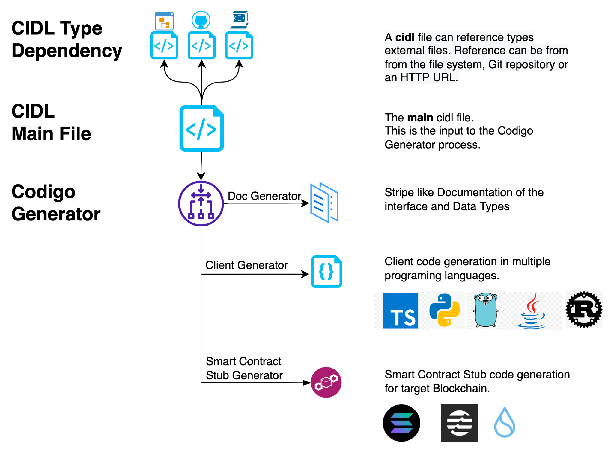

# Specification

## Overview

Codigo Generator is a set of tools and engines to generate “Smart Contracts” stubs, Client code and documentation from a
**Codigo’s Interface Description Language** or **CIDL** file.

“**Smart Contract**” stubs are generated in full source, verified and audited, code. Developers will need to only
implement the business logic for each stub, avoiding the repetitive boilerplate code for validation, verification and
parsing.

**Client Code** generation supports multiple programming languages. It takes a **CIDL** as input and generates full
client compilable code. The client code includes all the necessary elements to call the Smart Contract methods through
the underlying Blockchain.

Interacting with a Smart Contract is already possible via the RPC interfaces exposed by Blockchains Clients and
Validators. However, writing the boilerplate code that translates a programming language construct into RPC calls and
back is time-consuming, prone to errors and brittle - implementation bugs and security vulnerabilities can only be
detected during runtime.

## Goals

Codigo’s main goal is to speed Blockchain adoption by enabling Developers to focus on their business logic while Codigo
Generator takes care of all the rest.

1. **Generates “Smart Contract” boilerplate and stubs**
   Codigo Generator abstracts all the initialization, validation, verification and parsing for each incoming request,
   and routes the call to the specific stub method with all parameters validated and sanitized.

2. **Generates Client Libraries**
   Codigo Generators simplifies Smart Contract adoption by generating “Smart Contract” client libraries in multiple
   programming languages. Method calls are abstracted behind a simple API interface. All the boilerplate code to
   generate the actual Blockchain Smart Contract call is automatically generated by Codigo Generators for each
   programming language.

3. **Documentation**
   Codigo Generators creates full Smart Contract documentation based on the CIDL file.
   This documentation will list all exposed methods by the Smart Contract and input parameters. For Account based VMs,
   like Solana, full account structure is documented as well.
   The details of the documentation are an integral part of the CIDL file.

<!-- ## High Level Schematic Diagram
|  |
|:----------------------------------------------------------:| -->

## Codigo’s Interface Description Language CIDL

CIDL is a work in progress, open initiative to standardize how Smart Contracts Interfaces and data structures are
described.

The Codigo Interface Description Language defines a programming language-agnostic, interface description for Smart
Contract Interfaces and custom data types, which allows both humans and computers to discover and understand the
capabilities of a Smart Contract without requiring access to source code, additional documentation, or reverse
engineering. The CIDL Specification removes guesswork in calling a Smart Contract.

## CIDL Schema Definition

:::tip
CIDL Specification is a WIP. You can contribute to this specification by opening an
issues in
the [Código Platform Repo](https://github.com/Codigo-io/platform/issues/new?assignees=&labels=enhancement%2Ctriage&projects=Codigo-io%2F8&template=enhancement-request.yaml&title=%5BEnhancement%5D%3A+)
:::

```yaml
cidl: CIDL version
info: # Metadata of the smart contract
  name: smart contract name
  title: title or name of the smart contract
  version: version of the smart contract
  summary: smart contract description summary
  contact:
    name: contact name | company
    web: url of company | support
    email: email of contact | support
    git: git URL
  license:
    name: license name
    identifier: SPDX license expression
    url: license URL

imports: # Array external CIDLs
  - ref: name | name to be referenced inside this document.
    loc: url [ local file system, https, github ]
    solana:
      progid: pubkey | ID of the Program generated by the external CIDL

solana:
  seeds:
    <seed-name>: # Identifier for this seed definition
      bump: hardcoded bump value
      persist-bump: bump should be persisted or not
      items: # Array of seed's element, static or dynamic
        - name: literal value or variable name
          type: native or extended type, required to define dynamic seeds

types:
  <type-name>: # Identifier for this Structure
    summary: type description summary
    fields: # Array of fields
      - name: field name
        type: native | extended (with some exception) data type
        description: field description
        format: The format of this field [date-time, key, etc]
        attributes: Attribute to apply to the type [max=nn, min=nn, cap=nn]

methods: # Array of methods | instructions
  - name: method name
    summary: description of this method
    solana:
      default-payer: boolean, if false disables the default fee payer. Only applicable if signers are not defined
      compress: # Array of types that should be compressed
        - type: reference to a custom-defined type
          mode: append | insert_or_append | replace_leaf | verify_leaf
    signers: # Array of signers
      - name: signer name
        type: native | extended (with some exception) data type
      - input: input name, when set, the input will be mark as a signer
    uses: # Array of string
      - import_ref.method_name
    inputs: # Array of inputs
      - name: input name
        type: [ import_ref. ] native | custom-defined type | extended
        description: short description of this input parameter
        attributes: Attribute to apply to the type [sol:init, sol:writable, cap=nn]

errors: # Array - Custom Errors definition
  - id: ErrorIdentifier
    msg: Error message 
```

### Metadata

In this section the developer defines Smart Contract general settings, such as Smart Contract Name, Version and a full
description of the Smart Contract capabilities to be parsed by the Documentation Generator.

#### `cidl`

```yaml
cidl: CIDL version
```

| Keyword | Type         | Optionality | Description                        |
|---------|--------------|-------------|------------------------------------|
| cidl    | Spec version | Required    | A valid CIDL specification version |

#### `info`

```yaml showLineNumbers
info: # Metadata of the smart contract
  name: smart contract name
  title: title or name of the smart contract
  version: version of the smart contract
  summary: smart contract description summary
  contact:
    name: contact name | company
    web: url of company | support
    email: email of contact | support
    git: git URL
  license:
    name: license name
    identifier: SPDX license expression
    url: license URL
```

| Keyword | Type                   | Optionality | Description |
|---------|------------------------|-------------|-------------|
| info    | [InfoBody](#info-body) | Required    |             |

#### Info Body

The info object containing general information about the contract

| Keyword | Type                         | Optionality | Description                                                                                                  |
|---------|------------------------------|-------------|--------------------------------------------------------------------------------------------------------------|
| name    | string                       | Required    | The smart contract name. This name will be used to generate the smart contract and client libraries projects |
| title   | string                       | Required    | The title will be used to generate the web-based documentation for the smart contract                        |
| version | string                       | Required    | The smart contract [semantic version](https://docs.npmjs.com/about-semantic-versioning)                      |
| summary | string                       | Recommended | The summary will be used to generate the web-based documentation for the smart contract. Supports markdown   |
| contact | [ContactBody](#contact-body) | Optional    |                                                                                                              |
| license | [LicenseBody](#license-body) | Required    |                                                                                                              |

##### Contact Body

The contact object defines the owner of the CIDL and its contact information

| Keyword | Type   | Optionality | Description                        |
|---------|--------|-------------|------------------------------------|
| name    | string | Recommended | Name of the CIDL maintainer        |
| web     | Url    | Recommended | Website URL of the CIDL maintainer |
| email   | Email  | Recommended | Email of the CIDL maintainer       |
| git     | Url    | Recommended | Git URL of this CIDL repository    |

##### License Body

The license object defines the license governing this CIDL.

| Keyword    | Type                                                                      | Optionality        | Description                        |
|------------|---------------------------------------------------------------------------|--------------------|------------------------------------|
| name       | string                                                                    | Required           | The license name used for the CIDL |
| identifier | [SPDX](https://spdx.org/spdx-specification-21-web-version#h.jxpfx0ykyb60) | Mutually exclusive | An SPDX license expression         |
| url        | Url                                                                       | Mutually exclusive | A URL to the license used          |

:::info
Between `identifier` and `url`, only one is required.
:::

### Imports

This section defines how to import external CIDL to be reused while defining a new interface.
External CIDL locations can be versioned, to lock a specific version of a CIDL, or generic, pointing to the latest
version ( not recommended ). To be supported in future versions.

#### `imports`

```yaml showLineNumbers
imports: # Array external CIDLs
  - ref: name | name to be referenced inside this document.
    loc: url [ local file system, https, github ]
    solana:
      progid: pubkey | ID of the Program generated by the external CIDL
```

| Keyword | Type                         | Optionality | Description |
|---------|------------------------------|-------------|-------------|
| imports | [ImportsBody](#imports-body) | Optional    |             |

#### Imports Body

The import object defines from where the CIDL is being imported

| Keyword | Type                               | Optionality | Description                                                                                                                                                                         |
|---------|------------------------------------|-------------|-------------------------------------------------------------------------------------------------------------------------------------------------------------------------------------|
| ref     | string                             | Required    | Reference name. Used as a prefix when an element of this CIDL is used locally. Each ref has to be unique                                                                            |
| loc     | string                             | Required    | Location of the CIDL. The location can be: Local File System, URL (GitHub, HTTP), CIDL Hub. Locations can include a version indicator to lock the external CIDL to a stable version |
| solana  | [Solana](#solana-import-extension) | Optional    |                                                                                                                                                                                     |

##### Solana Import Extension

The solana import extension object defines the additional configuration for the CIDL import

| Keyword | Type                                                               | Optionality | Description                                                                       |
|---------|--------------------------------------------------------------------|-------------|-----------------------------------------------------------------------------------|
| progid  | [PublicKey](https://docs.solana.com/terminology#public-key-pubkey) | Required    | The Program ID ( as a Public Key ) of the Program generated by the imported CIDL. |

### Types

This section defines new Data Structures. These structures can be referenced by methods.

#### `types`

```yaml showLineNumbers
types:
  <type-name>: # Identifier for this Structure
    summary: type description summary
    fields: # Array of fields
      - name: field name
        type: native | extended (with some exception) data type
        description: field description
        format: The format of this field [date-time, key, etc]
        attributes: Attribute to apply to the type [max=nn, min=nn, cap=nn]
```

| Keyword | Type                                                    | Optionality | Description |
|---------|---------------------------------------------------------|-------------|-------------|
| types   | Map&lt;[TypeKey](#type-key), [TypeBody](#type-body)&gt; | Optional    |             |

#### Type Key

Type name `<type-name>` must comply with the targeted programming language. The Type
name is, the key to the type object map, is used to identify the data structure within the method definition. This
identifier will also become the name for the smart contract data structure to be referenced within the code.

#### Type Body

The type body object defines additional keywords to describe the data structure

| Keyword | Type                                  | Optionality | Description                                                                                                        |
|---------|---------------------------------------|-------------|--------------------------------------------------------------------------------------------------------------------|
| summary | string                                | Recommended | Documentation summary of the data structure. Supports markdown                                                     |
| fields  | Array&lt;[FieldBody](#field-body)&gt; | Required    | An array of fields through which we can define the properties of the data structure. At least 1 field is required. |

##### Field Body

The Field array field is required even if it has a single entry. Future reviews may include simple Type Definitions for
single entry types

| Keyword     | Type                                       | Optionality | Description                                                                                                                                                                                               |
|-------------|--------------------------------------------|-------------|-----------------------------------------------------------------------------------------------------------------------------------------------------------------------------------------------------------|
| name        | string                                     | Required    | The name of the property, it must follows the targeted programming naming convention                                                                                                                      |
| type        | [native](#native) \| [extended](#extended) | Required    | The data type of this property                                                                                                                                                                            |
| format      | string                                     | Optional    | Represents the internal format of the field. For example a String can represent a **date, an email address or a url**. Extended types can also be used to represent Blockchain Accounts, PublicKeys, etc. |
| attributes  | Array&lt;string&gt;                        | Optional    | Attributes to modify/extend the type                                                                                                                                                                      |
| description | string                                     | Recommended | Documentation of the field. Supports markdown                                                                                                                                                             |

### Methods

The Method Section describes the interface signature for each instruction exposed by the Smart Contract.

#### `methods`

```yaml showLineNumbers
methods: # Array of methods | instructions
  - name: method name
    summary: description of this method
    solana:
      default-payer: boolean, if false disables the default fee payer. Only applicable if signers are not defined
      compress: # Array of types that should be compressed
        - type: reference to a custom-defined type
          mode: append | insert_or_append | replace_leaf | verify_leaf
    signers: # Array of signers
      - name: signer name
        type: native | extended (with some exception) data type
      - input: input name, when set, the input will be mark as a signer
    uses: # Array of string
      - import_ref.method_name
    inputs: # Array of inputs
      - name: input name
        type: [ import_ref. ] native | custom-defined type | extended
        description: short description of this input parameter
        attributes: Attribute to apply to the type [sol:init, sol:writable, cap=nn]
```

| Keyword | Type                                    | Optionality | Description |
|---------|-----------------------------------------|-------------|-------------|
| methods | Array&lt;[MethodBody](#method-body)&gt; | Required    |             |

#### Method Body

| Keyword | Type                                    | Optionality | Description                                                                                                              |
|---------|-----------------------------------------|-------------|--------------------------------------------------------------------------------------------------------------------------|
| name    | string                                  | Required    | The name of the method, it must follows the targeted programming naming convention                                       |
| summary | string                                  | Recommended | Documentation summary of the method. Supports markdown                                                                   |
| solana  | [Solana](#solana-method-extension)      | Optional    |                                                                                                                          |
| signers | Array&lt;[SignerBody](#signer-body)&gt; | Optional    |                                                                                                                          |
| inputs  | Array&lt;[InputBody](#input-body)&gt;   | Optional    |                                                                                                                          |
| uses    | Array&lt;string&gt;                     | Optional    | List of reference methods in the form of `ref.method_name`, where `ref` is the value set in the [imports](#imports-body) |

##### Solana Method Extension

| Keyword       | Type                                        | Optionality | Description                                                                                                     |
|---------------|---------------------------------------------|-------------|-----------------------------------------------------------------------------------------------------------------|
| default-payer | boolean                                     | Optional    | By default, it is set to `true`. Set to `false` with an empty signer list to remove all signers from the method |
| compress      | Array&lt;[CompressBody](#compress-body)&gt; | Optional    | List of types to be compress.                                                                                   |

###### Compress Body

| Keyword | Type                                                                | Optionality | Description                                                                                                                                                                                    |
|---------|---------------------------------------------------------------------|-------------|------------------------------------------------------------------------------------------------------------------------------------------------------------------------------------------------|
| type    | [Type](#types) \| ref.[Type](#types)                                | Required    | Can reference imported CIDLs in the form of `ref.type_name`, where `ref` is the value set in the [imports](#imports-body)                                                                      |
| mode    | append \| insert_or_append           \| replace_leaf \| verify_leaf | Required    | How should this type be compress. Each mode corresponds to a method of the [state compression program](https://github.com/Codigo-io/platform/blob/develop/solana/spl_account_compression.yaml) |

###### Signer Body

| Keyword    | Type                                 | Optionality        | Description                                                                                                               |
|------------|--------------------------------------|--------------------|---------------------------------------------------------------------------------------------------------------------------|
| name       | string                               | Mutually exclusive | The name for the signing account.                                                                                         |
| type       | [Type](#types) \| ref.[Type](#types) | Mutually exclusive | Can reference imported CIDLs in the form of `ref.type_name`, where `ref` is the value set in the [imports](#imports-body) |
| input      | string                               | Mutually exclusive | Reference to an input's name. It will set the input as a signer                                                           |
| attributes | Array&lt;string&gt;                  | Optional           | Attributes to modify/extend the type. Only applicable when type is define                                                 |

:::info
`name`/`type` are mutually exclusive with `input`. This means
that `name`/`type` needs to be set or `input`, both cannot be defined
at the same time.
:::

##### Input Body

| Keyword     | Type                                                                               | Optionality | Description                                                                                                                                                                      |
|-------------|------------------------------------------------------------------------------------|-------------|----------------------------------------------------------------------------------------------------------------------------------------------------------------------------------|
| name        | string                                                                             | Required    | The name of the parameter, it must follows the targeted programming naming convention                                                                                            |
| type        | [native](#native) \| [extended](#extended) \| [Type](#Types) \| ref.[Type](#Types) | Required    | The data type of this parameter&lt;br /&gt;&lt;br /&gt;Can reference imported CIDLs in the form of `ref.type_name`, where `ref` is the value set in the [imports](#imports-body) |
| description | string                                                                             | Recommended | Documentation of the input. Supports markdown                                                                                                                                    |
| attributes  | Array&lt;string&gt;                                                                | Optional    | Attributes to modify/extend the type                                                                                                                                             |

### Errors

This section defines how to allow users to include personalized error messages associated to their business logic.

#### `errors`

```yaml showLineNumbers
errors: # Array - Custom Errors definition
  - id: ErrorIdentifier
    msg: Error message 
```

| Keyword | Type                       | Optionality | Description |
|---------|----------------------------|-------------|-------------|
| errors  | [ErrorsBody](#errors-body) | Optional    |             |

##### Errors Body

| Keyword | Type   | Optionality | Description                                        |
|---------|--------|-------------|----------------------------------------------------|
| id      | string | Required    | Must comply with the targeted programming language |
| msg     | string | Required    |                                                    |

## Built-in data types

### Native

This work in progress table describes the built-in native types supported by this specification. Translation to actual
Programming Languages types will be added in followup up reviews.

| Data Type | Length                             | Attributes |  
|-----------|------------------------------------|------------|
| u8        | 8-bit unsigned integer             |            |
| u16       | 16-bit unsigned integer            |            |
| u32       | 32-bit unsigned integer            |            |
| u64       | 64-bit unsigned integer            |            |
| u128      | 128-bit unsigned integer           |            |
| u256      | 256-bit unsigned integer           |            |
| i8        | 8-bit signed integer               |            |
| i16       | 16-bit signed integer              |            |
| i32       | 32-bit signed integer              |            |
| i64       | 64-bit signed integer              |            |
| i128      | 128-bit signed integer             |            |
| i256      | 256-bit signed integer             |            |
| f32       | 32-bit signed float                |            |
| f64       | 64-bit signed float                |            |
| bool      | 1 bit                              |            |
| string    | Depends on the targeted blockchain | `cap=\d+`  |
| bytes     | Depends on the targeted blockchain | `cap=\d+`  |

### Extended

Type extensions are custom data types. In this revision of the document, type extensions are built-in into the
generator. Future revisions may add custom-made Type Extensions.

They are identified by a prefix identifier, a colon and the name of the type, i.e. **prefix:identifier**.

| Data Types                      | Length                             | Attributes                                                                                                                                                                                                                                                                     | Comments                                                                                                                                                                                                                                                                                              |
|---------------------------------|------------------------------------|--------------------------------------------------------------------------------------------------------------------------------------------------------------------------------------------------------------------------------------------------------------------------------|-------------------------------------------------------------------------------------------------------------------------------------------------------------------------------------------------------------------------------------------------------------------------------------------------------|
| array                           | Depends on the targeted blockchain | `cap=\d+`                                                                                                                                                                                                                                                                      |
| sol:pubkey                      | 32 bytes                           |                                                                                                                                                                                                                                                                                | Type specific to the Solana blockchain. Transpiles to [Pubkey](https://docs.rs/solana-program/1.15.2/solana_program/pubkey/struct.Pubkey.html) data type.                                                                                                                                             |
| sol:account&lt;T?, seeds.K?&gt; | It depends                         | `sol:writable` <br /> `sol:init` <br /> `sol:init_if_needed` <br /> `sol:close` <br /> `sol:close_uncheck` <br /> `sol:space=\d+` <br /> `sol:owner=Pubkey` <br /> `sol:address=Pubkey` <br /> `sol:rent-payer=signer_name` <br /> `sol:rent-receiver=input_name\|signer_name` | Type specific to the Solana blockchain. `T` is the name of a custom-defined type, it can be omitted with underscored `_`. `K` is the name of a seed definition. `T` and `K` can reference imported CIDLs in the form of `ref.type_name`, where `ref` is the value set in the [imports](#imports-body) | 
| sol:merkle_tree                 | It depends                         | `sol:authority=signer_name` <br/> `sol:canopy=\d+` <br/> `cap=\d+`                                                                                                                                                                                                             | Type specific to the Solana blockchain. Transpiles to [AccountInfo](https://docs.rs/solana-program/1.15.2/solana_program/account_info/struct.AccountInfo.html) data type with the owner set to the account compression program.                                                                       |

### Data type modifier

`?` marks the field or input as optional/nullable. It must be added at the end of the type definition.

```yaml
- name: field_name
  type: u64?
```

## Join the Código community 💚

Código is a growing community of developers. Join us on
**[Discord](https://discord.gg/8XHQGS832k)**
and **[GitHub](https://github.com/Codigo-io)**
