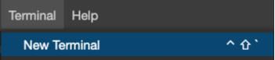
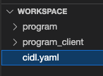

# Part III - Building Solana Programs with CIDL: A Comprehensive Guide 

In the first part of this guide, we learned some basic Solana concepts, described what we are building, and how to define Solana Accounts in the CIDL. If you need a refresher on those concepts or don’t know what a Solana instruction, transaction, or signer is, please check the first part [Building Solana Program with CIDL: A Comprehensive Guide - Part I](https://docs.codigo.ai/guides/guide-1).

In the second part of this guide, we added behavior to our program through methods, also known as instructions. In this third and final part, we will generate our smart contract, implement our business logic and create a simple integration app. Let’s get started!

Remember to follow along from the repository clone in part I.

## Execute Código AI Generator

Congratulations on completing the TODOs. With the CIDL completed, we can generate the smart contract and TypeScript library. For that, open a new terminal; Terminal -> New Terminal

|  |
| :-------------------------------------------------: |
|                 *New Terminal*           |

Type the following command to execute the generator: `codigo generate cidl.yaml`

When it completes generating the code, you will see three new directories in the explorer as follows:

|  |
| :-------------------------------------------------: |
|                 *Directories*           |

- `codigolib` this directory contains all security verification and serialization/deserialization utils with corresponding test cases.
- `generated` this directory contains all the files for a native solana contract and the stubs where we will implement the business logic.
- `sdk` this directory will contain all the files for the TypeScript client library. 

## Implement the business logic

When we expand the `generated` directory, we will see numerous files corresponding to a native solana smart contract; we don’t need to change anything on these files; thus, we can ignore them. The files we are interested in and where we will implement the business logic are inside the `stub` directory.

|  |
| :-------------------------------------------------: |
|                 *Stub Directory*           |

If we open one of those files, we will see a function with the same name as the file. Each file corresponds to a method defined in the CIDL. Inside each file, we can see a function where we will be implementing the business logic, the parameters of the function are determined by the inputs define for the method in the CIDL. 

### Implement create_user_record

Open the file `generated/rendered/stubs/create_user_record.rs` and replace the comment `// Place your custom code here…` with the following line:

```rust showLineNumbers
user_record.data.name = user_name;
```
### Implement register_income

Open the file `generated/rendered/stubs/register_income.rs` and replace the comment `// Place your custom code here…` with the following line:

```rust showLineNumbers
user_record.data.moves += 1;
user_record.data.income += amount;
user_record.data.total_balance += amount as i64;
```

### Implement register_outcome

Open the file `generated/rendered/stubs/register_outcome.rs` and replace the comment `// Place your custom code here…` with the following line:

```rust showLineNumbers
user_record.data.moves += 1;
user_record.data.outcome += amount;
user_record.data.total_balance -= amount as i64;
```

Congratulations! After implementing seven lines of business logic code, you have a secure working solana contract. The next step is to build and deploy it!

## Build and deploy the smart contract
Código Studio comes with all the tools and programs for building and deploying smart contracts.

First, let’s build the contract. Open a new terminal by going to Terminal -> New Terminal. Navigate to the generated directory by typing the command `cd generated`, and inside the `generated` directory, type the following command:

```shell
cargo build-sbf
```

This command will take a few seconds to complete. When the previous command completes, open another terminal by going to Terminal -> New Terminal. In the new terminal, type the command:

```shell
solana-test-validator
```

This command will start a solana validator to where we will be able to deploy the contract. Keep the terminal open so the validator continues running. Finally, return to the terminal where you built the contract and type the command:

```shell
solana program deploy target/deploy/budget_tracker.so
```

This command will deploy the built contract to the local solana validator we ran in the previous step. When the command completes, it will return the _Program Id_ of the contract and save it for later.

## Integrate the TypeScript client library

Wow! We have built and deployed a Solana smart contract in just a few minutes. The last step is to use this smart contract from our application. For this QuickStart, our application will be a command line interface.

Create a new file inside the `sdk` directory named `app.ts`. The file's content is the following:

```typescript showLineNumbers
import {
    createUserRecordSendAndConfirm,
    getRecord,
    registerIncomeSendAndConfirm,
    registerOutcomeSendAndConfirm,
    SetProgramId
} from "./index";
import {Connection, Keypair} from "@solana/web3.js";
import * as fs from "fs/promises";
import * as path from "path";
import * as os from "os";

async function main(feePayer: Keypair) {
    // TODO: Specify the smart contract Program Id we saved from when we deploy the smart contract
    SetProgramId("PASTE_YOUR_PROGRAM_ID");

    // Instantiate a new Solana connection
    const connection = new Connection("http://127.0.0.1:8899");

    // 1. Create a user record, logs the state of the account after creating it
    await createUserRecordSendAndConfirm(connection, "John Doe", feePayer.publicKey, feePayer);
    let record = await getRecord(connection, feePayer.publicKey);
    console.info(record);

    // 2. Registered a new income with a value of 100
    await registerIncomeSendAndConfirm(connection, 100, feePayer.publicKey, feePayer);
    record = await getRecord(connection, feePayer.publicKey);
    console.info(record);

    // 3. Registered a new outcome with a value of 50
    await registerOutcomeSendAndConfirm(connection, 50, feePayer.publicKey, feePayer);
    record = await getRecord(connection, feePayer.publicKey);
    console.info(record);
}

fs.readFile(path.join(os.homedir(), ".config/solana/id.json"))
    .then(file => main(Keypair.fromSecretKey(new Uint8Array(JSON.parse(file.toString())))));
```

Before executing the file, we need to specify the contract we want to communicate. When we deployed the smart contract, it returned a _Program Id_; this _Progrma Id_ should be pasted as a string to the function `SetProgramId();`

Finally, execute the app.ts file. Open a new terminal by going to Terminal -> New Terminal. Navigate to the sdk directory `cd sdk`; install the node dependencies executing the command `yarn install` and then execute the file using the following command:

```shell
npx ts-node app.ts
```

If everything went Ok, you should see the following output:

```shell
Record {
  name: 'John Doe',
  moves: 0,
  outcome: 0,
  income: 0,
  totalBalance: 0n,
  pubkey: PublicKey [PublicKey(HoFZA9XdaR28mm7YGcqAvo1tk8C9UY6Mz2fKEQRcbAZG)] {
    _bn: <BN: f9942a305de619bad344e097e6cdbef152ae52420a78507a3f429dba72ca1953>
  }
}
Record {
  name: 'John Doe',
  moves: 1,
  outcome: 0,
  income: 100,
  totalBalance: 100n,
  pubkey: PublicKey [PublicKey(HoFZA9XdaR28mm7YGcqAvo1tk8C9UY6Mz2fKEQRcbAZG)] {
    _bn: <BN: f9942a305de619bad344e097e6cdbef152ae52420a78507a3f429dba72ca1953>
  }
}
Record {
  name: 'John Doe',
  moves: 2,
  outcome: 50,
  income: 100,
  totalBalance: 50n,
  pubkey: PublicKey [PublicKey(HoFZA9XdaR28mm7YGcqAvo1tk8C9UY6Mz2fKEQRcbAZG)] {
    _bn: <BN: f9942a305de619bad344e097e6cdbef152ae52420a78507a3f429dba72ca1953>
  }
}
``` 

## Next steps

**Congratulations!** 🎉👏 you just created your first Solana smart contract using the CIDL and integrated the generated TypeScript client library with an application. To summarize what we learned:

- CIDL stands for Código Interface Description Language, and it is the input for Código’s AI Generator.
- After completing the CIDL, developers only need to concentrate on implementing the business logic of the smart contract. 100% of the client libraries and smart contracts boilerplate are automatically generated.
- Código Studio has all the tools and programs to develop smart contracts using the CIDL.
- Solana accounts will be wrapped with the `WithMeta` struct through which you can access a deserialized `data` and the additional fields of the `AccountInfo`.


These links may help you on your journey to writing smart contracts with the CIDL:

- [Learning the Basics](https://docs.codigo.ai/cidl/Learning%20the%20Basics)
- [Solana Extension](https://docs.codigo.ai/cidl/Blockchain%20Extensions/Solana/)
- [Creating the web-based documentation](https://docs.codigo.ai/guides/web-based%20documentation)
- [Completing the stubs and using the SDK](https://docs.codigo.ai/guides/Stubs%20and%20SDK)


### Join the Codigo community 💚
Código is a growing community of developers. Join us on **[Discord](https://docs.google.com/forms/d/e/1FAIpQLSdSG0OgJ5xuwwU7JiSGBdn01L3ID68qNCd2HAnFSztXVYKmBg/viewform)** and **[GitHub](https://docs.google.com/forms/d/e/1FAIpQLSdGDGH4bwQf5dX3-uFCYeRKzIGbd5dVEPxHKQPTt63bBVVcVQ/viewform)** 

