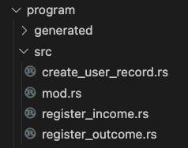
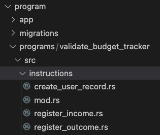

import Tabs from '@theme/Tabs';
import TabItem from '@theme/TabItem';

# Implementing business logic

After defining your CIDL, the next step is to implement the business logic.
This document will take you through this process.

:::caution
As good security best practices and owner of the implemented business logic, you, the developer, should always validate
and sanitize the input sent from the client. As the implementer of the business logic, you are the only one who can
determine what is valid or invalid data for your business. Please review
our [Terms of Service](https://codigo.ai/documents/Codigo---Terms-of-Service.pdf) for more information.
:::

:::tip
When we execute the solana generate command we always generate the program and the client, but,
we can generate only the Solana program code by using the flag `--only-program` (short: `-p`)

```shell
codigo solana generate /path/yo/your.cidl --only-program
```

:::

For this doc, we will use the budget tracker example; you can clone it
from [here](https://github.com/Codigo-io/platform/tree/develop/examples/solana_native/budget_tracker). The budget
tracker CIDL will generate the following stub
files.

<Tabs groupId="extension">
  <TabItem value="native" label="Solana Native">
    

    After Código AI Generator completes its job, you will find a directory named `src` within the generated directories and
    files. We will implement the business logic in these stub files. Each method defined in the CIDL will have a file with
    the same name as the method inside the `src` directory.

    Whenever we open one of the stub files, we will see a function corresponding to the same name as the file; thus, the same
    name as the method defined in the CIDL. For example, if we open the `create_user_record.rs`, we will see the following
    code:

    ```rust showLineNumbers
    use solana_program::account_info::AccountInfo;
    use solana_program::entrypoint::ProgramResult;
    use solana_program::pubkey::Pubkey;

    use crate::generated::state::{
      AccountPDA,
      Record,
    };


    /// To call once per account. Initialize a Record account. The total_balance of the account will be set to 0.
    ///
    /// Accounts:
    /// 0. `[writable, signer]` fee_payer: [AccountInfo]
    /// 1. `[writable]` user_record: [Record]
    /// 2. `[]` system_program: [AccountInfo] Auto-generated, for account initialization
    ///
    /// Data:
    /// - user_name: [String] The username to be assigned to the Record.name property
    /// - user_record_seed_index: [u8] Auto-generated, from input user_record of type [Record] set the seed named index, required by the type
    pub fn create_user_record(
      program_id: &Pubkey,
      user_record: &mut AccountPDA<Record>,
      user_name: String,
    ) -> ProgramResult {
      // Implement your business logic here...

      Ok(())
    }
    ```
  </TabItem>

  <TabItem value="anchor" label="Solana Anchor">
    

    After Código AI Generator completes its job, you will find a directory named `instructions` within the generated directories and
    files. We will implement the business logic in these stub files. Each method defined in the CIDL will have a file with
    the same name as the method inside the `instructions` directory.

    Whenever we open one of the stub files, we will see a function named `handler`. This convention corresponds
    to how Anchor structures their projects. For example, if we open the `create_user_record.rs`, we will see the following
    code:

    ```rust showLineNumbers
    use crate::*;
    use anchor_lang::prelude::*;

    /// To call once per account. Initialize a Record account. The total_balance of the account will be set to 0.
    ///
    /// Accounts:
    /// 0. `[writable, signer]` fee_payer: [AccountInfo]
    /// 1. `[writable]` user_record: [Record]
    /// 2. `[]` system_program: [AccountInfo] Auto-generated, for account initialization
    ///
    /// Data:
    /// - user_name: [String] The username to be assigned to the Record.name property
    /// - user_record_seed_index: [u8] Auto-generated, from the input "user_record" for its seed definition "RecordCollection", sets the seed named "index"
    pub fn handler(
      ctx: Context<CreateUserRecord>,
      user_name: String,
    ) -> Result<()> {
      // Implement your business logic here...

      Ok(())
    }
    ```
  </TabItem>
</Tabs>

:::tip
All business logic is implemented within the stub directories. For Solana Anchor this directory will be named
`instructions`, for Native, it will be `src`. Within this directory, you can create other directories to implement
your domain.
:::

When we specify the method’s summary and the inputs’ description, Código AI Generator will render documentation comments
into the source code, allowing developers to understand the source code and build the documentation using the
command `cargo doc`.

If the method definition in the CIDLs includes inputs, these will also be rendered into the stub function. It is
important to note that you will receive the data structure wrap for complex blockchain data structures like Solana
Accounts. The wrapper's purpose is to add the data itself of the data structure, the data used to build it, and any
additional metadata information that comes with it.

Finally, you will be implementing the business logic inside the stub functions. From here on, you can create your
business models and use these business models within the stub functions.

## Next steps

Congratulations! 🎉👏 at this point, you should have a basic understanding of implementing business logic.
These links may help you on your journey to writing smart contracts with the CIDL:

- [Solana basics](../getting-started/quickstart-solana)
- [Learning the basics](../learning-the-basics)
- [Integrating the client library](integrating-the-sdk)

### Join the Código community 💚

Código is a growing community of developers. Join us on
**[Discord](https://discord.gg/8XHQGS832k)**
and **[GitHub](https://github.com/Codigo-io)**
