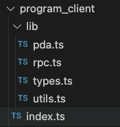
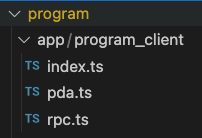

import Tabs from '@theme/Tabs';
import TabItem from '@theme/TabItem';

# Integrating client library

After defining your smart contract interfaces, implementing business logic, and deploying your smart contract
the next step is to integrate the client library. This document will take you through this process.

:::tip
When we execute the solana generate command we always generate the program and the client, but,
we can generate only the Solana program code by using the flag `--only-client` (short: `-c`)

```shell
codigo solana generate /path/yo/your.cidl --only-client
```
:::

For this doc, we will use the budget tracker example; you can clone it
from [here](https://github.com/Codigo-io/platform/tree/develop/examples/solana_native/budget_tracker). The budget
tracker CIDL will generate the following client library files.

<Tabs groupId="extension">
  <TabItem value="native" label="Solana Native">
    

    For Solana Native, the client library will be generated in a directory named `program_client`.
    This `program_client` is a TypeScript library that can be added as a dependency to your package.json.
    You can read more on how to add dependencies to package.json from the official documentation [here](https://docs.npmjs.com/specifying-dependencies-and-devdependencies-in-a-package-json-file)

    For each method defined in the CIDL you will get two JS/TS functions:
    - The first will be named exactly like the method and it will return a [TransactionInstruction](https://solana-labs.github.io/solana-web3.js/classes/TransactionInstruction.html)
    that can be used to build your transaction.
    - The second will be suffix with `SendAndConfirm`, it will return a [TransactionSignature](https://solana-labs.github.io/solana-web3.js/types/TransactionSignature.html)
    which internally, builds and sends the transaction.

```ts showLineNumbers
/**
 * ### Returns a {@link TransactionInstruction}
 * Register the given amount as an income for the given record account. The total total_balance of the account will be increased.
 *
 * Accounts:
 * 0. `[writable, signer]` fee_payer: {@link PublicKey}
 * 1. `[writable]` user_record: {@link Record}
 *
 * Data:
 * - amount: {@link number} The amount to be registered as the income.
 * - user_record_seed_index: {@link number} Auto-generated, from the input "user_record" for the its seed definition "RecordCollection", sets the seed named "index"
 */
export const registerIncome = (
  args: RegisterIncomeArgs,
  remainingAccounts: Array<PublicKey> = [],
): TransactionInstruction => {
  const data = serialize(
    {
      struct: {
        id: "u8",
        amount: "u32",
        user_record_seed_index: "u8",
      },
    },
    {
      id: ValidateBudgetTrackerInstruction.RegisterIncome,
      amount: args.amount,
      user_record_seed_index: args.userRecordSeedIndex,
    },
  );

  const [userRecordPubkey] = pda.deriveRecordCollectionPDA(
    {
      signer: args.feePayer,
      index: args.userRecordSeedIndex,
    },
    _programId,
  );

  return new TransactionInstruction({
    data: Buffer.from(data),
    keys: [
      { pubkey: args.feePayer, isSigner: true, isWritable: true },
      { pubkey: userRecordPubkey, isSigner: false, isWritable: true },
      ...remainingAccounts.map((e) => ({
        pubkey: e,
        isSigner: false,
        isWritable: false,
      })),
    ],
    programId: _programId,
  });
};

/**
 * ### Returns a {@link TransactionSignature}
 * Register the given amount as an income for the given record account. The total total_balance of the account will be increased.
 *
 * Accounts:
 * 0. `[writable, signer]` fee_payer: {@link PublicKey}
 * 1. `[writable]` user_record: {@link Record}
 *
 * Data:
 * - amount: {@link number} The amount to be registered as the income.
 * - user_record_seed_index: {@link number} Auto-generated, from the input "user_record" for the its seed definition "RecordCollection", sets the seed named "index"
 */
export const registerIncomeSendAndConfirm = async (
  args: Omit<RegisterIncomeArgs, "feePayer"> & {
    signers: {
      feePayer: Keypair;
    };
  },
  remainingAccounts: Array<PublicKey> = [],
): Promise<TransactionSignature> => {
  const trx = new Transaction();

  trx.add(
    registerIncome(
      {
        ...args,
        feePayer: args.signers.feePayer.publicKey,
      },
      remainingAccounts,
    ),
  );

  return await sendAndConfirmTransaction(_connection, trx, [
    args.signers.feePayer,
  ]);
};
```

  </TabItem>

  <TabItem value="anchor" label="Solana Anchor">
    

    For Solana Anchor, the client library will be generated within the same `program` directory within
    directory named `app/program_client`. Anchor follows a "monorepo" style, you can add your other application
    i.e. web apps, Node.js API in the app directory. By doing so, your application will automatically have access
    to the `program_client`.

    For each method defined in the CIDL you will get three JS/TS functions:
    - The first function will be named like the method suffix with `Builder. This one returns a [MethodBuilder](https://github.com/coral-xyz/anchor/blob/2f552a17f5e4cb0f5b075240c2645b6485e59752/ts/packages/anchor/src/program/namespace/methods.ts#L115)
    and is used to create the following two functions and keep a seamless integration with Anchor SDK.
    - The second will be named exactly like the method and it will return a [TransactionInstruction](https://solana-labs.github.io/solana-web3.js/classes/TransactionInstruction.html)
    that can be used to build your transaction.
    - The third will be suffix with `SendAndConfirm`, it will return a [TransactionSignature](https://solana-labs.github.io/solana-web3.js/types/TransactionSignature.html)
    which internally, builds and sends the transaction.

```ts showLineNumbers
/**
* ### Returns a {@link MethodsBuilder}
* To call once per account. Initialize a Record account. The total_balance of the account will be set to 0.
*
* Accounts:
* 0. `[writable, signer]` fee_payer: {@link PublicKey}
* 1. `[writable]` user_record: {@link Record}
* 2. `[]` system_program: {@link PublicKey} Auto-generated, for account initialization
*
* Data:
* - user_name: {@link string} The username to be assigned to the Record.name property
* - user_record_seed_index: {@link number} Auto-generated, from the input "user_record" for the its seed definition "RecordCollection", sets the seed named "index"
*/
export const createUserRecordBuilder = (
  args: CreateUserRecordArgs,
  remainingAccounts: Array<web3.AccountMeta> = [],
): MethodsBuilder<ValidateBudgetTracker, never> => {
  const [userRecordPubkey] = pda.deriveRecordCollectionPDA({
      signer: args.feePayer,
      index: args.userRecordSeedIndex,
    },
    _program.programId,
  );

  return _program.methods
    .createUserRecord(args.userName, args.userRecordSeedIndex)
    .accounts({
      feePayer: args.feePayer,
      userRecord: userRecordPubkey,
      systemProgram: new web3.PublicKey("11111111111111111111111111111111"),
    })
    .remainingAccounts(remainingAccounts);
};

/**
* ### Returns a {@link web3.TransactionInstruction}
* To call once per account. Initialize a Record account. The total_balance of the account will be set to 0.
*
* Accounts:
* 0. `[writable, signer]` fee_payer: {@link PublicKey}
* 1. `[writable]` user_record: {@link Record}
* 2. `[]` system_program: {@link PublicKey} Auto-generated, for account initialization
*
* Data:
* - user_name: {@link string} The username to be assigned to the Record.name property
* - user_record_seed_index: {@link number} Auto-generated, from the input "user_record" for the its seed definition "RecordCollection", sets the seed named "index"
*/
export const createUserRecord = (
  args: CreateUserRecordArgs,
  remainingAccounts: Array<web3.AccountMeta> = [],
): Promise<web3.TransactionInstruction> =>
  createUserRecordBuilder(args, remainingAccounts).instruction();

/**
* ### Returns a {@link web3.TransactionSignature}
* To call once per account. Initialize a Record account. The total_balance of the account will be set to 0.
*
* Accounts:
* 0. `[writable, signer]` fee_payer: {@link PublicKey}
* 1. `[writable]` user_record: {@link Record}
* 2. `[]` system_program: {@link PublicKey} Auto-generated, for account initialization
*
* Data:
* - user_name: {@link string} The username to be assigned to the Record.name property
* - user_record_seed_index: {@link number} Auto-generated, from the input "user_record" for the its seed definition "RecordCollection", sets the seed named "index"
*/
export const createUserRecordSendAndConfirm = async (
  args: Omit<CreateUserRecordArgs, "feePayer"> & {
  signers: {
    feePayer: web3.Signer;
  };
},
  remainingAccounts: Array<web3.AccountMeta> = [],
  ): Promise<web3.TransactionSignature> => {
  const preInstructions: Array<web3.TransactionInstruction> = [];

  return createUserRecordBuilder({
      ...args,
      feePayer: args.signers.feePayer.publicKey,
    },
    remainingAccounts,
  )
  .preInstructions(preInstructions)
  .signers([args.signers.feePayer])
  .rpc();
};
```

  </TabItem>
</Tabs>

When we specify the method’s summary and the inputs’ description, Código AI Generator will render documentation comments
into the source code, allowing developers to understand the source code and build the documentation using typedoc.

Código AI Generator, generates 100% of the boilerplate code. This means that the client library is ready to be
integrated with your applications. The client libraries support the browser and Node.js application.

## Next steps

Congratulations! 🎉👏 at this point, you should have a basic understanding of integrating the client library.
These links may help you on your journey to writing smart contracts with the CIDL:

- [Solana basics](../getting-started/quickstart-solana)
- [Learning the basics](../learning-the-basics)
- [Implementing the business logic](implementing-business-logic)

### Join the Código community 💚

Código is a growing community of developers. Join us on
**[Discord](https://discord.gg/8XHQGS832k)**
and **[GitHub](https://github.com/Codigo-io)**
