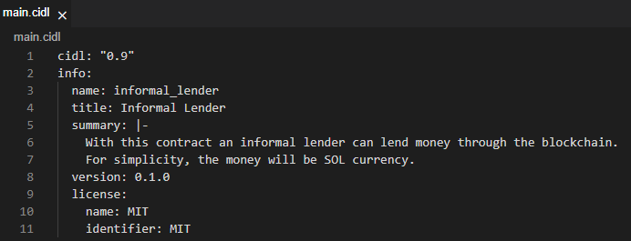
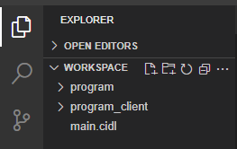

# Lender

In this guide, you’ll learn how to build a simple defi dApp in under an hour using the [Código Platform](https://studio.codigo.ai). We will be building a dApp that will allow informal lenders to lend money.

Código is an AI-powered code Generation Platform for blockchain developers and web3 teams that saves development time and increases the code's security.

To get started, **Create an account** on [Código Platform](https://studio.codigo.ai) following the steps mentioned [here](../getting-started/installation.md#código-studio)

<!-- ## Create an account
When entering  you will be received with the following screen. You can access Código Studio using your GitHub account or by creating a new account with any email address:


Código Studio is a web-based IDE that allows you to develop dApp using Solana and the Código Platform. The web-based IDE comes with all the required components to build Solana dApp i.e. Solana Development suite tool, Anchor, Código CLI, Node.js, Rust, and more -->

:::info
The first time you create an account, provisioning your environment can take **3 to 5 minutes**.
:::

## Create & implement the CIDL for a simple DeFi

After creating your account and successfully accessing the environment we can start writing the CIDL. Create a new file named `main.cidl` from your file explorer. 

The *CIDL (Código Interface Description Language)* is the input to Código’s Generator; in it, we define our Solana program types and methods.


### Implementing the CIDL metadata

The first part we need to implement of the CIDL is the CIDL’s spec version and program information. With this metadata information, Código’s Generator and other people will know which CIDL specification version is used, the contract name, its license, and more. Copy and paste the following code to your `main.cidl` file:

```yaml
cidl: "0.9"
info:
  name: informal_lender
  title: Informal Lender
  summary: |-
    With this contract an informal lender can lend money through the blockchain.
    For simplicity, the money will be SOL currency.
  version: 0.1.0
  license:
    name: MIT
    identifier: MIT
```

After copying and pasting successfully, your `main.cidl` file should look like this:



### Implementing the types
The CIDL structure is really simple, you basically have types and methods (will see this in the next point). In the types, we define the models of the data we want to store in the blockchain. For our simple defi, we defined 2 types, the first named Broker and the second Loan.

The Broker will store the capital amount that is available to lend, the amount it has lent, the revenue, and the fee percentage a client needs to pay as interest upon making a payment. With all this data and a small intervention by the informal lender, the program will be able to determine if it can lend a loan. 

The Loan type will store the data for a given loan. Like the amount lent and paid, whether the loan is approved or not, and the KYC (Know Your Customer) information. These 2 last points are really important, based on the country's law before lending money the lender needs to screen the person to whom it will lend money. This is the small step we mentioned previously, where the informal lender needs to intervene in the approval of a loan.

Finally, copy and paste the following code into your `main.cidl` file

```yaml
solana:
  seeds:
    Broker:
      items:
        - name: broker
    Loan:
      items:
        - name: loan
        - name: client
          type: sol:pubkey
        - name: index
          type: u32
types:
  Broker:
    summary: |-
      Broker is an account that can only exist once per contract.
      It stores all the require information to lend money.
    fields:
      - name: delegate
        type: sol:pubkey
        description: Only this delegate can modify the Broker account
      - name: capital
        type: u128
        description: The amount of money staked
      - name: lended
        type: u128
        description: The amount of money lended
      - name: revenue
        type: u128
        description: The amount of money earn
      - name: fee
        type: u8
        description: The percentage a client needs to pay when paying a loan
  Loan:
    summary: |-
      Loan is an account that will exist as many times is required
      per client it stores a request to a Loan and if the loan is approved
      it stores the amount payed.
    fields:
      - name: client
        type: sol:pubkey
        description: The client that owns this loan
      - name: amount
        type: u64
        description: The amount of money the client borrow
      - name: payed
        type: u64
        description: The amount of money this client has payed
      - name: kyc_url
        type: string
        description: URL to the client's KYC document require by law
        attributes: [ cap=96 ]
      - name: fee
        type: u8
        description: The fee this client needs to pay for this loan when making payments
      - name: approved
        type: bool
        description: Flag state if the loan was approved by the broker or not
```

After copying and pasting successfully, your `main.cidl` file should look like this:


### Implementing the methods
The final step in implementing the CIDL is to implement the methods. Through the methods, we defined the behavior that will determine how the models will change data over time or how it will be created. For this workshop, we defined 5 methods.

1. Create broker method will be creating the broker model and saving it to the blockchain. This method can only be called once per program.
2. Add capital to the broker will allow the informal lender to add additional capital at any point in time.
3. Request loan allows the informal lender’s client to request a loan
4. Approve loan allows the informal lender to approve a loan, when the loan is approved the funds will be transferred to the client’s wallet
5. Pay loan will be used by the client to pay the lent money, every time a client makes a payment it will pay interest, and this interest will be the informal lender revenue.

Copy and paste the following methods into your `main.cidl` file

```yaml
methods:
  - name: create_broker
    summary: |-
      After deploying the contract this must be the first instruction
      to call. It will configure the broker account.
    signers:
      - name: fee_payer
        type: sol:account
        attributes: [ sol:writable ]
      - input: delegate
    inputs:
      - name: delegate
        type: sol:account
        description: This will be the account that has permission to update the broker and approved request.
        attributes: [ sol:writable ]
      - name: broker
        type: sol:account<Broker, seeds.Broker>
        attributes: [ sol:init ]
      - name: amount
        type: u64
        description: The amount to be added to the capital. It will be debited from the delegate account
      - name: fee
        type: u8
  - name: add_capital_to_broker
    summary: Through this instruction any one can add capital to the broker
    signers:
      - name: fee_payer
        type: sol:account
        attributes: [ sol:writable ]
      - input: delegate
    inputs:
      - name: delegate
        type: sol:account
        attributes: [ sol:writable ]
      - name: broker
        type: sol:account<Broker, seeds.Broker>
        attributes: [ sol:writable ]
      - name: amount
        type: u64
        description: The amount to be added to the capital. It will be debited from the delegate account
  - name: request_loan
    summary: This instruction is used by a client to request a loan
    signers:
      - name: fee_payer
        type: sol:account
        attributes: [ sol:writable ]
      - input: client
    inputs:
      - name: client
        type: sol:account
      - name: loan
        type: sol:account<Loan, seeds.Loan(client=client)>
        attributes: [ sol:init ]
      - name: broker
        type: sol:account<Broker, seeds.Broker>
      - name: amount
        type: u64
        description: The request amount to borrow
      - name: kyc_url
        type: string
  - name: approve_loan
    summary: |-
      Through this instruction the delegate can approve a loan.
      Upon approval, the funds will be transfer from the broker
      account to the client's account.
    signers:
      - name: fee_payer
        type: sol:account
        attributes: [ sol:writable ]
      - input: delegate
    inputs:
      - name: delegate
        type: sol:account
      - name: loan
        type: sol:account<Loan, seeds.Loan(client=client)>
        attributes: [ sol:writable ]
      - name: broker
        type: sol:account<Broker, seeds.Broker>
        attributes: [ sol:writable ]
      - name: client
        type: sol:account
        attributes: [ sol:writable ]
  - name: pay_loan
    summary: |-
      A client can pay a loan through this instruction. When paying
      the contract will calculate the interest based on the loan approved
      fee. Additioanlly, it will transfer money from the client's account
      to the broker account
    signers:
      - name: fee_payer
        type: sol:account
        attributes: [ sol:writable ]
      - input: client
    inputs:
      - name: client
        type: sol:account
        attributes: [ sol:writable ]
      - name: loan
        type: sol:account<Loan, seeds.Loan(client=client)>
        attributes: [ sol:writable ]
      - name: broker
        type: sol:account<Broker, seeds.Broker>
        attributes: [ sol:writable ]
      - name: amount
        type: u64
        description: The amount to pay to the loan
```

After copying and pasting successfully, your main.cidl file should look like this in the methods section (with them collapsed):


The final CIDL must look like this:

```yaml
cidl: "0.9"
info:
  name: informal_lender
  title: Informal Lender
  summary: |-
    With this contract an informal lender can lend money through the blockchain.
    For simplicity, the money will be SOL currency.
  version: 0.1.0
  license:
    name: MIT
    identifier: MIT
solana:
  seeds:
    Broker:
      items:
        - name: broker
    Loan:
      items:
        - name: loan
        - name: client
          type: sol:pubkey
        - name: index
          type: u32
types:
  Broker:
    summary: |-
      Broker is an account that can only exist once per contract.
      It stores all the require information to lend money.
    fields:
      - name: delegate
        type: sol:pubkey
        description: Only this delegate can modify the Broker account
      - name: capital
        type: u128
        description: The amount of money staked
      - name: lended
        type: u128
        description: The amount of money lended
      - name: revenue
        type: u128
        description: The amount of money earn
      - name: fee
        type: u8
        description: The percentage a client needs to pay when paying a loan
  Loan:
    summary: |-
      Loan is an account that will exist as many times is required
      per client it stores a request to a Loan and if the loan is approved
      it stores the amount payed.
    fields:
      - name: client
        type: sol:pubkey
        description: The client that owns this loan
      - name: amount
        type: u64
        description: The amount of money the client borrow
      - name: payed
        type: u64
        description: The amount of money this client has payed
      - name: kyc_url
        type: string
        description: URL to the client's KYC document require by law
        attributes: [ cap=96 ]
      - name: fee
        type: u8
        description: The fee this client needs to pay for this loan when making payments
      - name: approved
        type: bool
        description: Flag state if the loan was approved by the broker or not
methods:
  - name: create_broker
    summary: |-
      After deploying the contract this must be the first instruction
      to call. It will configure the broker account.
    signers:
      - name: fee_payer
        type: sol:account
        attributes: [ sol:writable ]
      - input: delegate
    inputs:
      - name: delegate
        type: sol:account
        description: This will be the account that has permission to update the broker and approved request.
        attributes: [ sol:writable ]
      - name: broker
        type: sol:account<Broker, seeds.Broker>
        attributes: [ sol:init ]
      - name: amount
        type: u64
        description: The amount to be added to the capital. It will be debited from the delegate account
      - name: fee
        type: u8
  - name: add_capital_to_broker
    summary: Through this instruction any one can add capital to the broker
    signers:
      - name: fee_payer
        type: sol:account
        attributes: [ sol:writable ]
      - input: delegate
    inputs:
      - name: delegate
        type: sol:account
        attributes: [ sol:writable ]
      - name: broker
        type: sol:account<Broker, seeds.Broker>
        attributes: [ sol:writable ]
      - name: amount
        type: u64
        description: The amount to be added to the capital. It will be debited from the delegate account
  - name: request_loan
    summary: This instruction is used by a client to request a loan
    signers:
      - name: fee_payer
        type: sol:account
        attributes: [ sol:writable ]
      - input: client
    inputs:
      - name: client
        type: sol:account
      - name: loan
        type: sol:account<Loan, seeds.Loan(client=client)>
        attributes: [ sol:init ]
      - name: broker
        type: sol:account<Broker, seeds.Broker>
      - name: amount
        type: u64
        description: The request amount to borrow
      - name: kyc_url
        type: string
  - name: approve_loan
    summary: |-
      Through this instruction the delegate can approve a loan.
      Upon approval, the funds will be transfer from the broker
      account to the client's account.
    signers:
      - name: fee_payer
        type: sol:account
        attributes: [ sol:writable ]
      - input: delegate
    inputs:
      - name: delegate
        type: sol:account
      - name: loan
        type: sol:account<Loan, seeds.Loan(client=client)>
        attributes: [ sol:writable ]
      - name: broker
        type: sol:account<Broker, seeds.Broker>
        attributes: [ sol:writable ]
      - name: client
        type: sol:account
        attributes: [ sol:writable ]
  - name: pay_loan
    summary: |-
      A client can pay a loan through this instruction. When paying
      the contract will calculate the interest based on the loan approved
      fee. Additioanlly, it will transfer money from the client's account
      to the broker account
    signers:
      - name: fee_payer
        type: sol:account
        attributes: [ sol:writable ]
      - input: client
    inputs:
      - name: client
        type: sol:account
        attributes: [ sol:writable ]
      - name: loan
        type: sol:account<Loan, seeds.Loan(client=client)>
        attributes: [ sol:writable ]
      - name: broker
        type: sol:account<Broker, seeds.Broker>
        attributes: [ sol:writable ]
      - name: amount
        type: u64
        description: The amount to pay to the loan
```

## Generate code
After completing the implementation of your CIDL, the next step is to generate code. Open a new terminal by going to `Terminal > New Terminal`


Before being able to generate code, you need to authenticate with your GitHub account into the Código CLI, you can achieve this by typing the command `codigo login` which will prompt a GitHub URL which you will need to open and paste an **8 digits code**, the code will be also prompted by the previous command.

1. **Codigo Login**

Enter the command `codigo login` and you will be prompted with a GitHub URL and a device code


2. **GitHub URL for device activation**


3. After completing the code input, you will receive a screen like this where you need to **Authorize Código CLI**


4. After confirmation, you will be prompted with a **login successfully** message in the web-based IDE terminal. Now you are all set, you can generate code


After login to Código CLI, from the terminal type the command `codigo solana generate main.cidl` with this command, Código CLI will generate the Solana program and client library


After the generation has finished, in the file explorer you will see 2 new directories, one name program, and the other program_client. The program_client will be added as a dependency to our web app or Node.js API to integrate it with our product, for the workshop we will do it a little bit simpler. In the program directory, we will be implementing the business logic.



## Implement the business logic

After generating the code, if you expand the program directory you will see a directory named src, in the src directory you will find a file that corresponds to each method defined in the CIDL, these files contain the stub function for each method where you will be implementing the business logic. In the generated directory you can find all the files and code Código generated, is recommended to not modify these files.


### Implement create_broker
Replace the comment `// Implement your business logic here…` with the following code:

```rust
  // Set initial broker state
    broker.data.delegate = *delegate.key;
    broker.data.capital = amount as u128;
    broker.data.lended = 0;
    broker.data.revenue = 0;
    broker.data.fee = fee;

    // Transfer from delegate account to broker's account
    **delegate.try_borrow_mut_lamports()? -= amount;
    **broker.info.try_borrow_mut_lamports()? += amount;
```

The business logic for `create broker` is straightforward, we are setting the default values to our Broker model and we are funding the broker with some capital so the program will be able to lend the given capital. We also stored the wallet of the user who’s creating the broker, this will be used later for security checks. 

### Implement add_capital_to_broker

Replace the comment `// Implement your business logic here…` with the following code:

```rust
   // Update broker's capital amount
    broker.data.capital += amount as u128;

    // Transfer from delegate account to broker's account
    **delegate.try_borrow_mut_lamports()? -= amount;
    **broker.info.try_borrow_mut_lamports()? += amount;
```

The business logic for `add capital to broker` is similar to the previous method, here we are adding more funds to the broker’s capital.

### Implement request_loan
Replace the comment `// Implement your business logic here…` with the following code:

```rust
   // Check if the broker has enough capital to lend
    if broker.data.capital.saturating_sub(amount as u128) <= 0 {
        return Err(InformalLenderError::InvalidInstruction.into());
    }

    loan.data.client = *client.key;
    loan.data.amount = amount;
    loan.data.payed = 0;
    loan.data.kyc_url = kyc_url;
    loan.data.fee = broker.data.fee;
    loan.data.approved = false;
```

We start to see a pattern here, where implementing business logic is straightforward. The business logic for `request loan` is also simple, first, we check if the broker has capital available to lend, because the capital is stored in an unsigned number we need to subtract using a special rust function named `saturatin_sub`, then we compare the result of this function and check if it is less or equal to 0, if true, it means that the broker doesn’t have enough capital to lend the requested amount, thus, the program returns an error. If the broker has the capital to lend, then we proceed with creating the loan model.

For this implementation you will need to add in line 10 the following import:
```bash
use crate::generated::errors::InformalLenderError;
```

### Implement approve_loan
Replace the comment `// Implement your business logic here…` with the following code:

```rust
// Check if the broker has enough capital to lend
    if broker.data.capital.saturating_sub(loan.data.amount as u128) <= 0 {
        return Err(InformalLenderError::InvalidInstruction.into());
    }

    // Check if the delegate is the authorized user by the broker
    if broker.data.delegate != *delegate.key {
        return Err(InformalLenderError::InvalidInstruction.into());
    }

    // Check if the client to which we will transfer the funds is the client that requested the loan
    if *client.key != loan.data.client {
        return Err(InformalLenderError::InvalidInstruction.into());
    }

    // Update the broker state
    broker.data.capital -= loan.data.amount as u128;
    broker.data.lended += loan.data.amount as u128;
    loan.data.approved = true;

    // Transfer from broker account to client's account
    **broker.info.try_borrow_mut_lamports()? -= loan.data.amount;
    **client.try_borrow_mut_lamports()? += loan.data.amount;
```

Similar to `request loan` we check if the broker has enough capital to lend. Afterward, we check if the user authorizing the loan is the same user that created the broker, this check is really important because without it, any user will be able to approve loans, and we don’t want that. We also check the wallet to which we will be transferring the funds, we need to verify that we are transferring the funds to the correct client. Finally, we transfer the funds.

For this implementation you will need to add in line 10 the following import: 
```bash
use crate::generated::errors::InformalLenderError;
```

### Implement pay_loan
Replace the comment `// Implement your business logic here…` with the following code:

```rust
// Check if the client is not over-paying
    if loan.data.payed + amount > loan.data.amount {
        return Err(InformalLenderError::InvalidInstruction.into());
    }

    // Calculate how much interest the client need to pay
    let interest = loan.data.amount / loan.data.fee as u64;

    // Update the broker state
    broker.data.revenue += interest as u128;
    broker.data.capital += amount as u128;
    broker.data.lended -= amount as u128;

    // Update loan's payed amount
    loan.data.payed += amount;

    // Transfer from client's account to broker account
    let total = amount + interest;
    **client.try_borrow_mut_lamports()? -= total;
    **broker.info.try_borrow_mut_lamports()? += total;

    msg!("Loan amount: {}, Interest: {}, Total: {}", loan.data.amount, interest, total);
```

The final business logic we need to implement is for `pay loan`, here we check if the client is not overpaying a loan then we proceed to calculate the interest the client needs to pay and finally we debit the client’s wallet and credit the brokers' wallet. For the sake of simplicity, the interest calculation is straightforward, but for a production environment, we need to improve the calculation so the informal lender doesn’t lose cents. 

For this implementation, you will need to add in line 10 the following import:
```bash
use crate::generated::errors::InformalLenderError;
```

## Build & deploy the program

**Congratulations!!** You have successfully created and implemented a Solana program the next step is to build and deploy the contract. But before doing that, open your `Cargo.toml` file and add the following dependency: 

```toml
ahash = "=0.8.6"
```

After adding the previous dependency, your `Cargo.toml` must look like this:


[The reason for this is that in one of the Solana SDK dependencies, there was a change that broke the Solana SDK.](https://github.com/solana-labs/solana/issues/34609) This can be fixed by adding the previous dependency. This fix has *already been applied to our latest Código CLI version* which will be released in a few weeks. Now, to where we were:

Open a new terminal by going to `Terminal -> New Terminal`. Navigate to the program directory by typing the command cd program, and inside the program directory, type the following command `cargo build-sbf`


This command will take a few seconds to complete. When the previous command completes, open another terminal by going to `Terminal -> New Terminal`. In the new terminal, type the command `solana-test-validator` you will get logs similar to the image. Don’t close the terminal, otherwise, the solana validator will be killed.


Finally, return to the terminal where you built the contract and type the command `solana program deploy target/deploy/informal_lender.so` This command will deploy the built contract to the local solana validator we ran in the previous step. When the command completes, it will return the Program Id of the contract, save it for later.


## Integrate the client library
Wow! We have built and deployed a Solana DeFi program in just a few minutes. The last step is to use this program from our application. For this workshop, we will keep it simple and integrate the program client into a Node.js CLI application. 

Go to your file explorer and create a new file named `app.ts` in the `program_client` directory:


In the file, app.ts copy and paste the following code:

```typescript
import { Connection, Keypair, LAMPORTS_PER_SOL, PublicKey, sendAndConfirmTransaction, SystemProgram, Transaction } from "@solana/web3.js";
import * as fs from "fs/promises";
import * as path from "path";
import * as os from "os";
import {
    approveLoanSendAndConfirm,
    createBrokerSendAndConfirm,
    deriveBrokerPDA,
    deriveLoanPDA,
    getBroker,
    getLoan,
    initializeClient,
    payLoanSendAndConfirm,
    requestLoanSendAndConfirm,
} from "./index";

async function main(feePayer: Keypair) {
    const connection = new Connection("http://127.0.0.1:8899", {
        commitment: "confirmed"
    });

    // TODO: Specify the smart contract Program Id we saved from when we deploy the smart contract
    const progId = new PublicKey("PASTE_YOUR_PROGRAM_ID_HERE");

    initializeClient(progId, connection);

    /**
    * Create wallets to represent the broker creator and 2 clients
    */
    const delegate = Keypair.generate();
    const client1 = Keypair.generate();
    const client2 = Keypair.generate();

    const rent = await connection.getMinimumBalanceForRentExemption(0);
    const capital = 5 * LAMPORTS_PER_SOL;
    const interest = 5 * LAMPORTS_PER_SOL;

    await sendAndConfirmTransaction(
        connection,
        new Transaction()
            .add(
                SystemProgram.createAccount({
                    fromPubkey: feePayer.publicKey,
                    newAccountPubkey: delegate.publicKey,
                    space: 0,
                    lamports: rent + capital,
                    programId: progId,
                })
            )
            .add(
                SystemProgram.createAccount({
                    fromPubkey: feePayer.publicKey,
                    newAccountPubkey: client1.publicKey,
                    space: 0,
                    lamports: rent + interest,
                    programId: progId,
                })
            )
            .add(
                SystemProgram.createAccount({
                    fromPubkey: feePayer.publicKey,
                    newAccountPubkey: client2.publicKey,
                    space: 0,
                    lamports: rent + interest,
                    programId: progId,
                })
            ),
        [feePayer, delegate, client1, client2]
    );

    const [brokerPK] = deriveBrokerPDA(progId);
    let broker = await getBroker(brokerPK)

    // Broken can only exists once per contract
    // so let's check if we haven't created it
    if (!broker) {
        await createBrokerSendAndConfirm({
            amount: BigInt(capital),
            fee: 10,
            signers: {
                feePayer,
                delegate,
            }
        });
        broker = await getBroker(brokerPK)
    } 

    // Log current state of the broker
    console.log("+=====+BROKER STATE+=====+")
    console.info(broker);

    // Request loan 1 by client 1
    const [client1Loan1] = deriveLoanPDA({
        client: client1.publicKey,
        index: 1,
    }, progId)
    await requestLoanSendAndConfirm({
        amount: BigInt(2.5 * LAMPORTS_PER_SOL),
        kycUrl: "https://example.com",
        loanSeedIndex: 1,
        signers: {
            feePayer,
            client: client1,
        }
    });
    console.log("+=====+CLIENT ONE LOAN ONE STATE+=====+")
    let client1Loan1State = await getLoan(client1Loan1);
    console.info(client1Loan1State);

    // Aprove loan 1 by client 1
    await approveLoanSendAndConfirm({
        client: client1.publicKey,
        loanSeedIndex: 1,
        signers: {
            feePayer,
            delegate,
        }
    });
    console.log("+=====+CLIENT ONE LOAN ONE STATE+=====+")
    client1Loan1State = await getLoan(client1Loan1);
    console.info(client1Loan1State);

    console.log("+=====+BROKER STATE+=====+")
    broker = await getBroker(brokerPK)
    console.info(broker);

    // Request loan 2 by client 1
    const [client1Loan2] = deriveLoanPDA({
        client: client1.publicKey,
        index: 2,
    }, progId)
    await requestLoanSendAndConfirm({
        amount: BigInt(2 * LAMPORTS_PER_SOL),
        kycUrl: "https://example.com",
        loanSeedIndex: 2,
        signers: {
            feePayer,
            client: client1,
        }
    });
    console.log("+=====+CLIENT ONE LOAN TWO STATE+=====+")
    let client1Loan2State = await getLoan(client1Loan2);
    console.info(client1Loan2State);

    // Aprove loan 2 by client 1
    await approveLoanSendAndConfirm({
        client: client1.publicKey,
        loanSeedIndex: 2,
        signers: {
            feePayer,
            delegate,
        }
    });
    console.log("+=====+CLIENT ONE LOAN TWO STATE+=====+")
    client1Loan2State = await getLoan(client1Loan2);
    console.info(client1Loan2State);

    console.log("+=====+BROKER STATE+=====+")
    broker = await getBroker(brokerPK)
    console.info(broker);

    // Request loan 1 by client 2
    // This request must fail because broker doesn't have capital
    try {
        const [client2Loan1] = deriveLoanPDA({
            client: client2.publicKey,
            index: 1,
        }, progId)
        await requestLoanSendAndConfirm({
            amount: BigInt(2 * LAMPORTS_PER_SOL),
            kycUrl: "https://example.com",
            loanSeedIndex: 1,
            signers: {
                feePayer,
                client: client2,
            }
        });
        let client2Loan1State = await getLoan(client2Loan1);
        console.info(client2Loan1State);
    } catch (e) {
        console.info(`Broker doesn't have capital to lend: ${e}`)
    }

    // Pay the full amount of loan 1 by client 1
    await payLoanSendAndConfirm({
        amount: BigInt(2.5 * LAMPORTS_PER_SOL),
        loanSeedIndex: 1,
        signers: {
            feePayer,
            client: client1,
        }
    });
    console.log("+=====+CLIENT ONE LOAN ONE STATE+=====+")
    client1Loan1State = await getLoan(client1Loan1);
    console.info(client1Loan1State);

    console.log("+=====+BROKER STATE+=====+")
    broker = await getBroker(brokerPK)
    console.info(broker);

    // Pay the full amount of loan 2 by client 1
    await payLoanSendAndConfirm({
        amount: BigInt(2 * LAMPORTS_PER_SOL),
        loanSeedIndex: 2,
        signers: {
            feePayer,
            client: client1,
        }
    });
    console.log("+=====+CLIENT ONE LOAN TWO STATE+=====+")
    client1Loan2State = await getLoan(client1Loan2);
    console.info(client1Loan2State);

    console.log("+=====+BROKER STATE+=====+")
    broker = await getBroker(brokerPK)
    console.info(broker);

    // Request loan 1 by client 2
    const [client2Loan1] = deriveLoanPDA({
        client: client2.publicKey,
        index: 1,
    }, progId)
    await requestLoanSendAndConfirm({
        amount: BigInt(2 * LAMPORTS_PER_SOL),
        kycUrl: "https://example.com",
        loanSeedIndex: 1,
        signers: {
            feePayer,
            client: client2,
        }
    });
    console.log("+=====+CLIENT TWO LOAN ONE STATE+=====+")
    let client2Loan1State = await getLoan(client2Loan1);
    console.info(client2Loan1State);

    console.log("+=====+BROKER STATE+=====+")
    broker = await getBroker(brokerPK)
    console.info(broker);
}

// 5_000_000_000n
// 450_000_007n

fs.readFile(path.join(os.homedir(), ".config/solana/id.json"))
    .then(file => main(Keypair.fromSecretKey(new Uint8Array(JSON.parse(file.toString())))));
```

Remeber to replace your program id you got after deploying your program in the string where it says `"PASTE_YOUR_PROGRAM_ID_HERE"`


The final step, open a new terminal by going to `Terminal -> New Terminal`. Navigate to the program client directory by typing the command `cd program_client`, and inside the program_client directory, type the following command `npm install @types/node ts-node` after it completes, execute the command `npx ts-node app.ts` if you did these steps correctly you will get the following output:


**Congratulations! 🎉👏** you just created your first *Solana DeFi program* using the [Código Platform](htttps://studio.codigo.ai). The `app.ts` code is straightforward, first, we create some wallets, and after that, we create the broker by calling the create_broker function, and we add a check to verify if the broker is not already created, otherwise, the Solana program returns an error. Secondly, we start to request, approve, and pay some loans, if we implemented the business logic correctly the loan life cycle should work as expected. 

## Join the Código community 💚 

Código is a growing community of developers. Join us on
**[Discord](https://discord.gg/8XHQGS832k)**
and **[GitHub](https://github.com/Codigo-io)**

