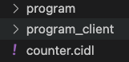

# Part III - Building Solana Programs

In the first part of this guide, we learned some basic Solana concepts, described what we are building, and how to
define Solana Accounts in the CIDL. If you need a refresher on those concepts or don’t know what a Solana instruction,
transaction, or signer is, please check the [Part I - Building Solana Programs](./part-1-building-solana-programs.md).

In the [second part](./part-2-building-solana-programs.md.md) of this guide, we added behavior to our program through
methods, also known as instructions. In this third and final part, we will generate our smart contract, implement our
business logic and create a simple integration app. Let’s get started!

Remember to follow along from the repository clone in part I.

## Execute Código AI Generator

After completing our contract's interface through the CIDL; the next step is to generate the smart contract and client
libraries. For that, open a new terminal; Terminal -> New Terminal

|  |
|:---------------------------------------------------------------:|
|                         *New Terminal*                          |

Type the following command to execute the generator: `codigo generate cidl.yaml`. The generation process will take a few
seconds; after it completes, in the explorer, we will see the following directories in the explorer:

|  |
|:-------------------------------------------------------------:|
|                         *Directories*                         |

- `codigolib` this directory contains all security verification and serialization/deserialization utils with
  corresponding test cases.
- `generated` this directory contains all the files for a native solana contract and the stubs where we will implement
  the business logic.
- `sdk` this directory will contain all the files for the TypeScript client library.

We can go through the generation process until we have achieved the desired smart contract interface.

:::caution
Código AI Generator will overwrite your stubs file for the private beta. Save your stub changes before rerunning the
generator.
:::

## Implement the business logic

Código AI Generators generates 100% of the client libraries and smart contract boilerplate; thus, our business logic is
the only code we need to write.

We implement our business logic within the `stubs` directory; we can find the `stubs` in the
path `generated/rendered/stubs`. Inside the `stubs` directory, we will see a file for each method defined in the CIDL;
since we have three methods, we will see three files with the same name as the methods.

|  |
|:----------------------------------------------------------------------------:|
|                               *Stub Directory*                               |

:::caution
You own and can modify all the generated code, but this is not recommended; the generated code comes with security
checks and test cases and is audited by a third party. Modifying the generated code may introduce bugs, security issues,
or unwanted behavior.
:::

### Implement `create_user_account`

Opening the `create_user_account.rs` file will reveal the following function

```rust showLineNumbers
use crate::rendered::state::*;
use solana_program::{account_info::*, entrypoint::*, pubkey::*};

/// Method used to initialize the User account.
///
/// # Arguments
///
/// * `user`
/// * `display_name`
pub fn create_user_account(user: &mut WithMeta<User>, display_name: String) -> ProgramResult {
    // Place your custom code here...

    Ok(())
}
```

Within this function (stub) is where we implement the business logic. The parameters of the function are the inputs
defined in the CIDL. The account data structure will be wrapped with the `WithMeta` struct.

If we recall from part I, everything in Solana is an account; the structure for this account is named `AccountInfo`.
The `AccountInfo` has various fields; one is the `data` field, where the Solana runtime stores our custom data.

The `WithMeta` wrapper aims to facilitate working with this `data`. The `data` from `AccountInfo` is an array of bytes;
with the wrapper, you will receive the `data` as a Rust struct. In other words, you don’t need to deserialize the `data`
of `AccountInfo`; this step has already been taken care of for you. But also, we can access the raw `AccountInfo`
structure through the `meta` property of the `WithMeta` struct.

Now let's implement the business logic for `create_user_account`. Replace the comment `/ Place your custom code here...`
with the following code

```rust showLineNumbers
user.data.display_name = display_name;
user.data.posts = 0;
```

The business logic for this method is simple. We assign the value of `display_name` to the field `display_name` of the
user account. After that, we set the posts to zero.

### Implement the `create_post_account`

With the previous explanation, we can jump directly into implementing the business logic. Remember, any account will be
wrapped with the `WithMeta` struct. Replace the comment `/ Place your custom code here...` with the following code

```rust showLineNumbers
// Increase post count
author.data.posts += 1;

// Assign post's data to a variable for easy access
let data = & mut post.data;
data.author = * author.meta.key;
data.title = title;
data.short_description = short_description;
data.feature_image_url = feature_image_url;
data.content_url = content_url;
data.category = category;
data.likes = 0;
data.dislikes = 0;
```

Similar to the previous method, the business logic for this method is also simple; thus, let's concentrate on the
interesting parts.

- We can access multiple accounts in one method
- Sometimes, accessing an account's `data` field may not be comfortable. For this reason, we can assign the `data` to a
  variable and modify it from the variable.
- We can read the `meta` of an account to access other properties of the `AccountInfo` struct.

### Implement the `create_comment_account`

Replace the comment `/ Place your custom code here...` with the following code

```rust showLineNumbers
comment.data.content = content;
comment.data.user = * user.meta.key;
comment.data.post = * post.meta.key;
```

We are starting to see a pattern here. After finishing the smart contract interface, we write the business logic. To
learn more about implementing business logic,
read [Completing the stubs and using the SDK](./completing-the-stubs-and-using-the-sdk.md)

## Build and deploy the smart contract

Excellent! We have finished implementing the business logic. The next step is to build and deploy the smart contract.

First, let’s build the contract. Open a new terminal by going to Terminal -> New Terminal. Navigate to the generated
directory by typing the command `cd generated`, and inside the `generated` directory, type the following command:

```shell
cargo build-sbf
```

This command will take a few seconds to complete. When the previous command completes, open another terminal by going to
Terminal -> New Terminal. In the new terminal, type the command:

```shell
solana-test-validator
```

This command will start a solana validator to where we will be able to deploy the contract. Keep the terminal open so
the validator continues running. Finally, return to the terminal where you built the contract and type the command:

```shell
solana program deploy target/deploy/budget_tracker.so
```

This command will deploy the built contract to the local solana validator we ran in the previous step. When the command
completes, it will return the _Program Id_ of the contract and save it for later.

## Integrate the TypeScript client library

Congratulations on building and deploying the smart contract. Now we will create a Node.Js CLI application and integrate
it with our generated SDK.

Create a new file inside the `sdk` directory named `app.ts`. The file's content is the following:

```typescript showLineNumbers
import {
    createCommentAccountSendAndConfirm,
    createPostsAccountSendAndConfirm,
    createUserAccountSendAndConfirm,
    getComments,
    getPosts,
    getUser,
    SetProgramId,
} from "./index";
import {Connection, Keypair, PublicKey} from "@solana/web3.js";
import * as fs from "fs/promises";
import * as path from "path";
import * as os from "os";
import {Posts, User} from "./types";

async function main(feePayer: Keypair) {
    // TODO: Specify your smart contract Program Id we saved from when we deploy the smart contract
    SetProgramId("SMART_CONTRACT_PROGRAM_ID");

    // Instantiate a new Solana connection
    const connection = new Connection("http://127.0.0.1:8899");

    // Create user accounts
    const john = await createUser(connection, "John Doe", feePayer);
    const maria = await createUser(connection, "Maria", feePayer);

    // Create a post
    const {postId, postIndex} = await createPost(
        connection,
        {
            title: "Quickstart",
            shortDescription:
                "In this Quickstart guide, you’ll learn how to start with Código’s Interface Description Language (CIDL) from scratch using our web-based IDE, Código Studio.",
            featureImageUrl: "https://example.com",
            contentUrl: "https://example.com",
            category: "Solana",
        },
        john.user,
        feePayer
    );

    // Add comment
    await commentPost(
        connection,
        "Nice!",
        postId,
        postIndex,
        john.user,
        maria.user,
        feePayer
    );
}

async function createUser(
    connection: Connection,
    name: string,
    feePayer: Keypair
): Promise<{ user: User; keypair: Keypair }> {
    const keypair = Keypair.generate();

    await createUserAccountSendAndConfirm(connection, keypair, name, feePayer);
    const user = await getUser(connection, keypair.publicKey);

    console.info(
        `Created user ${user.displayName}. Current posts: ${user.posts}.`
    );

    return {user, keypair};
}

async function createPost(
    connection: Connection,
    post: Omit<Posts, "likes" | "dislikes" | "author" | "pubkey">,
    author: User,
    feePayer: Keypair
): Promise<{ postId: PublicKey; postIndex: number }> {
    let postIndex = author.posts;

    await createPostsAccountSendAndConfirm(
        connection,
        author.pubkey,
        post.title,
        post.shortDescription,
        post.featureImageUrl,
        post.contentUrl,
        post.category,
        postIndex,
        feePayer
    );
    const postSaved = await getPosts(connection, author.pubkey, author.posts);
    console.info(
        `Created post ${postSaved.title}. Author ${author.displayName}.`
    );

    const user = await getUser(connection, author.pubkey);
    console.info(
        `Updated user ${user.displayName}. Current posts: ${user.posts}.`
    );

    return {
        postId: postSaved.pubkey,
        postIndex,
    };
}

async function commentPost(
    connection: Connection,
    comment: string,
    postId: PublicKey,
    postIndex: number,
    author: User,
    user: User,
    feePayer: Keypair
) {
    await createCommentAccountSendAndConfirm(
        connection,
        user.pubkey,
        comment,
        author.pubkey,
        postIndex,
        feePayer
    );
    const commentSaved = await getComments(connection, user.pubkey, postId);
    const post = await getPosts(connection, author.pubkey, postIndex);

    console.info(
        `Comment added to the post ${post.title}. Comment: ${commentSaved.content}`
    );
}

fs.readFile(path.join(os.homedir(), ".config/solana/id.json")).then((file) =>
    main(Keypair.fromSecretKey(new Uint8Array(JSON.parse(file.toString()))))
);
```

Before executing the file, we must specify the contract we want to communicate. When we deployed the smart contract, it
returned a _Program Id_; this _Progrma Id_ should be pasted as a string to the function `SetProgramId();`

Finally, execute the app.ts file. Open a new terminal by going to Terminal -> New Terminal. Navigate to the sdk
directory `cd sdk`; install the node dependencies executing the command `yarn install` and then execute the file using
the following command:

```shell
npx ts-node app.ts
```

If everything went Ok, you should see the following output:

```shell
Created user John Doe. Current posts: 0.
Created user Maria. Current posts: 0.
Created post Quickstart. Author John Doe.
Updated user John Doe. Current posts: 1.
Comment added to the post Quickstart. Comment: Nice!
``` 

## Next steps

Congratulations! 🎉👏 at this point, you should have a basic understanding of creating Solana Programs with the CIDL. To
summarize what we learned:

- After completing the CIDL, developers only need to concentrate on implementing the business logic of the smart
  contract. 100% of the client libraries and smart contracts boilerplate are automatically generated.
- Solana accounts will be wrapped with the `WithMeta` struct through which you can access a deserialized `data` and the
  additional fields of the `AccountInfo`.

These links may help you on your journey to writing smart contracts with the CIDL:

- [Learning the Basics](../código-interface-description-language/learning-the-basics.md)
- [Solana Extension](../código-interface-description-language/blockchain-extensions/solana)
- [Generating the web-based documentation](./generating-the-web-based-documentation.md)
- [Completing the stubs and using the SDK](./completing-the-stubs-and-using-the-sdk.md)

### Join the Código community 💚 

Código is a growing community of developers. Join us on
**[Discord](https://docs.google.com/forms/d/e/1FAIpQLSdSG0OgJ5xuwwU7JiSGBdn01L3ID68qNCd2HAnFSztXVYKmBg/viewform)**
and **[GitHub](https://docs.google.com/forms/d/e/1FAIpQLSdGDGH4bwQf5dX3-uFCYeRKzIGbd5dVEPxHKQPTt63bBVVcVQ/viewform)**

#### Documentation detectives wanted! If you've spotted any gaps or have suggestions to level up our documentation game, we'd love to hear from you!

[![Button Example]][Link]
[Link]: https://docs.google.com/forms/d/e/1FAIpQLSdekEIqR0Qc3f1mWSCOZsiXBL09lRk-kIU3kRuWO3cyRQEntQ/viewform
[Button Example]: https://img.shields.io/badge/Feedback-FD971F?style=for-the-badge