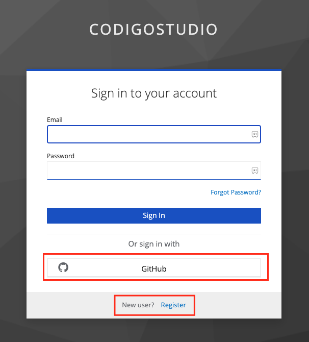
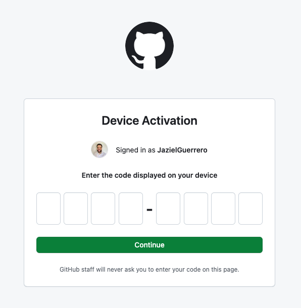
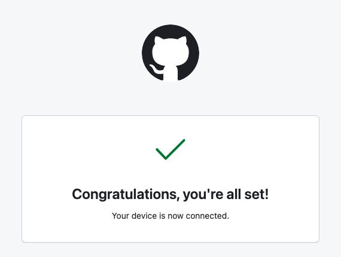

# Installation

There are multiple options to get started with the Código Platform.
The faster way is through [Código Studio](https://studio.codigo.ai).

## Código Studio

Código Studio is built on the foundation of Visual Studio Code, a popular
desktop code editor many developers use. As a result, if you have experience
using VSCode, you'll find that the web-based environment of Código Studio
will feel familiar and intuitive. [Código Studio](https://studio.codigo.ai) comes with
all the dependencies and configurations required to build dApps at the speed of light.

You can [**Sign Up**](https://studio.codigo.ai) using your GitHub account or create a new account using your email/password.
When opening the link, you will be received with the following screen:

To learn more about Código Studio [click here](./development-suite/codigo-studio.md)

## VSCode extension

Coming soon... In the following days, we will be releasing our VSCode extension
through which you will be able to start from a template, generate code, and get
the CIDL web-based documentation.

Follow us at [X](https://twitter.com/codigoplatform) to know more

## Código CLI

You can generate code through the Código VSCode extension, but if you want to still
do it from your terminal you can download the Código CLI. Select the installation link
that corresponds to your operating system

| Target              | Download Link |
| :------------------ | :------------ |
| Apple macOS (ARM64) | [Download](#) |
| Apple macOS (x86-64)| [Download](#) |
| Linux               | [Download](#) |
| Microsoft Windows   | [Download](#) |
> Código Studio comes pre-install with Código CLI

### Sign in to Código CLI

If you have accessed the platform through Código Studio or installed the Código CLI  manually
you are required to sign in with a GitHub account. To sign in, follow the next steps:

1. Execute the command `codigo login`. This command will print a GitHub link and a device code
2. Open the GitHub link https://github.com/login/device
3. Copy the 8 alphanumeric codes printed in your terminal by Código CLI
4. Paste the code in the GitHub page
   
5. Authorize the GitHub Código CLI app.
6. If everything went ok, you will be prompted
   with a success message from GitHub. In the terminal you will see
   "Login successfully!" message
   
