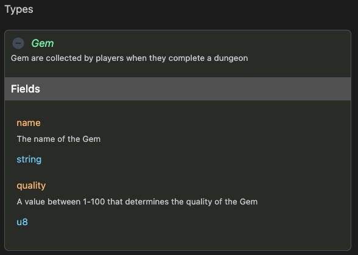

# Types

Custom-defined types allow teams to express their dApp in any form they require. A CIDL can define all the
required types to fulfill the needs; other CIDLs can import these types.

:::tip
You can define any number of data structures and fields required for your use case.
:::

:::caution
We cannot specify another custom type in a field’s type
:::

## Definition 

`types` is a key-value object. Where the key of the object is the name of the type, and the value
is an object through which we define the type structure.

```yaml showLineNumbers
types:
  Gem:
    summary: Gem are collected by players when they complete a dungeon
    fields:
      - name: name
        type: string
        attributes: [ sol:cap=36 ]
        description: The name of the Gem
      - name: quality
        type: u8
        description: A value between 1-100 that determines the quality of the Gem
```

| Keyword | Type                                                    | Optionality | Description |
|---------|---------------------------------------------------------|-------------|-------------|
| types   | Map<[TypeKey](#type-key), [TypeBody](#type-body)> | Optional    |             |

#### Type Key

Type name `<type-name>` must comply with the targeted programming language. The Type
name is, the key to the type object map, is used to identify the data structure within the method definition. This
identifier will also become the name for the smart contract data structure to be referenced within the code.

#### Type Body

The type body object defines additional keywords to describe the data structure

| Keyword | Type                                  | Optionality | Description                                                                                                        |
|---------|---------------------------------------|-------------|--------------------------------------------------------------------------------------------------------------------|
| summary | string                                | Recommended | Documentation summary of the data structure. Supports markdown                                                     |
| fields  | Array&lt;[FieldBody](#field-body)&gt; | Required    | An array of fields through which we can define the properties of the data structure. At least 1 field is required. |

##### Field Body

The Field array field is required even if it has a single entry. Future reviews may include simple Type Definitions for
single entry types

| Keyword     | Type                                       | Optionality | Description                                                                                                                                                                                               |
|-------------|--------------------------------------------|-------------|-----------------------------------------------------------------------------------------------------------------------------------------------------------------------------------------------------------|
| name        | string                                     | Required    | The name of the property, it must follows the targeted programming naming convention                                                                                                                      |
| type        | [native](#native) \| [extended](#extended) | Required    | The data type of this property                                                                                                                                                                            |
| format      | string                                     | Optional    | Represents the internal format of the field. For example a String can represent a **date, an email address or a url**. Extended types can also be used to represent Blockchain Accounts, PublicKeys, etc. |
| attributes  | Array&lt;string&gt;                        | Optional    | Attributes to modify/extend the type                                                                                                                                                                      |
| description | string                                     | Recommended | Documentation of the field. Supports markdown                                                                                                                                                             |

## Web-based documentation

The `types` object can be visualized in the CIDL web-based doc. The documentation is automatically generated from our
vscode-codigo extension.

[//]: # (This CIDL web-based doc can be generated by typing the command:)

[//]: # (```shell)

[//]: # (codigo solana generate ./counter.cidl --doc)

[//]: # (```)



## Next steps

At this point we should have the basis of defining custom-types and the supported native and extended data types, 
read about native and extended data type [here](data-types). If you have already read it, continue your learning 
path in the following links:

- [Imports](imports)
- [Methods](methods)

## Join the Código community 💚

Código is a growing community of developers. Join us on
**[Discord](https://discord.gg/8XHQGS832k)**
and **[GitHub](https://github.com/Codigo-io)**
