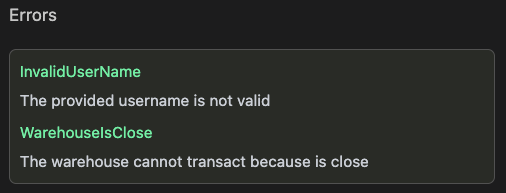

# Errors

All applications can return/throw errors. The CIDL gives a specific place where you can define these errors.

:::tip
You can define any number of methods required for your use case.
:::

## Definition

`errors` is an array of objects where each object is an error

```yaml showLineNumbers
errors: # Array - Custom Errors definition
  - id: ErrorIdentifier
    msg: Error message 
```

| Keyword | Type                       | Optionality | Description |
|---------|----------------------------|-------------|-------------|
| errors  | [ErrorsBody](#errors-body) | Optional    |             |

##### Errors Body

| Keyword | Type   | Optionality | Description                                        |
|---------|--------|-------------|----------------------------------------------------|
| id      | string | Required    | Must comply with the targeted programming language |
| msg     | string | Required    |                                                    |

## Web-based documentation

The `errors` object can be visualized in the CIDL web-based doc. The documentation is automatically generated from our
vscode-codigo extension.

[//]: # (This CIDL web-based doc can be generated by typing the command:)

[//]: # (```shell)

[//]: # (codigo solana generate ./counter.cidl --doc)

[//]: # (```)



## Next steps

You can follow our guides to start implementing use cases step by step
or check our examples [here](https://github.com/Codigo-io/platform/tree/develop/examples)

- [Lender guide](../guides/lender.md)
- [Inventory guide](../guides/inventory.md)
- [State compression guide](../guides/state-compression.md)
- [Solana NFT guide](../guides/solana-nft.md)

## Join the Código community 💚

Código is a growing community of developers. Join us on
**[Discord](https://discord.gg/8XHQGS832k)**
and **[GitHub](https://github.com/Codigo-io)**

