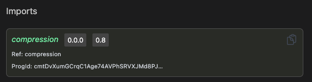

# Imports

Imports can take your idea and team productivity to the next level 🚀. Through imports, we can reduce the amount
of code, we need to write by using CIDLs provided by Código or the community to write composable CIDLs.

:::tip
You can define any number of imports required for your use case.
:::

:::tip
Imported CIDL can reference types, methods, and Solana seed definition
:::

## Definition

`imports` is an array of objects where each object is a CIDL that will be imported

```yaml showLineNumbers
imports:
  - ref: compression
    loc: ./solana_state_compression.cidl
    solana:
      progid: cmtDvXumGCrqC1Age74AVPhSRVXJMd8PJS91L8KbNCK
```
:::note
Currently, `loc` only supports the file system.
:::

| Keyword | Type                         | Optionality | Description |
|---------|------------------------------|-------------|-------------|
| imports | [ImportsBody](#imports-body) | Optional    |             |

#### Imports Body

The import object defines from where the CIDL is being imported

| Keyword | Type                               | Optionality | Description                                                                                                                                                                         |
|---------|------------------------------------|-------------|-------------------------------------------------------------------------------------------------------------------------------------------------------------------------------------|
| ref     | string                             | Required    | Reference name. Used as a prefix when an element of this CIDL is used locally. Each ref has to be unique                                                                            |
| loc     | string                             | Required    | Location of the CIDL. The location can be: Local File System, URL (GitHub, HTTP), CIDL Hub. Locations can include a version indicator to lock the external CIDL to a stable version |
| solana  | [Solana](#solana-import-extension) | Required    |                                                                                                                                                                                     |

##### Solana Import Extension

The solana import extension object defines the additional configuration for the CIDL import

| Keyword | Type                                                               | Optionality | Description                                                                       |
|---------|--------------------------------------------------------------------|-------------|-----------------------------------------------------------------------------------|
| progid  | [PublicKey](https://docs.solana.com/terminology#public-key-pubkey) | Required    | The Program ID ( as a Public Key ) of the Program generated by the imported CIDL. |

## Web-based documentation

The `imports` object can be visualized in the CIDL web-based doc. The documentation is automatically generated from our
vscode-codigo extension.

[//]: # (This CIDL web-based doc can be generated by typing the command:)

[//]: # (```shell)

[//]: # (codigo solana generate ./counter.cidl --doc)

[//]: # (```)



## Next steps

We are almost done with this learning path that began with the documentation on native and extended data types,
read about native and extended data types [here](data-types). To finalize this journey follow the following links:

- [Methods](methods)
- [Errors](errors)

## Join the Código community 💚

Código is a growing community of developers. Join us on
**[Discord](https://discord.gg/8XHQGS832k)**
and **[GitHub](https://github.com/Codigo-io)**
