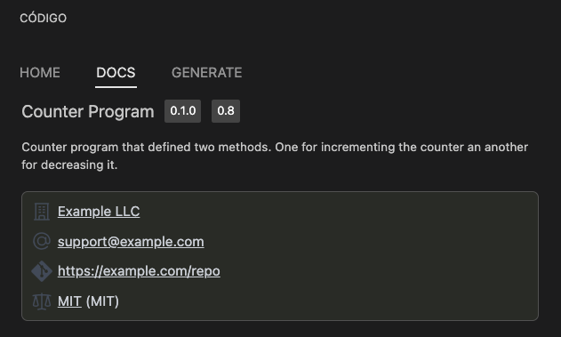

# Info

Each CIDL file we create must define some basic information. These pieces of information will help other developers
understand what the contract is about and will help our generators.

:::tip
Is good CIDL development practice to define a descriptive and detailed summary. This will help
your team and other developers that may consume your smart contract understand its capabilities.
:::

## Definition

`info` is an object through which we define the metadata of the smart contract.

```yaml showLineNumbers
cidl: 0.9
info:
  name: counter
  title: Counter Program
  version: 0.1.0
  summary: |-
    Counter program that defined two methods. One for incrementing
    the counter and another for decreasing it.
  contact:
    name: Example LLC
    web: https://example.com
    email: support@example.com
    git: https://example.com/repo
  license:
    name: MIT
    identifier: MIT
```

| Keyword | Type                   | Optionality | Description |
|---------|------------------------|-------------|-------------|
| info    | [InfoBody](#info-body) | Required    |             |

#### Info Body

The info object contains general information about the contract

| Keyword | Type                         | Optionality | Description                                                                                                  |
|---------|------------------------------|-------------|--------------------------------------------------------------------------------------------------------------|
| name    | string                       | Required    | The smart contract name. This name will be used to generate the smart contract and client libraries projects |
| title   | string                       | Required    | The title will be used to generate the web-based documentation for the smart contract                        |
| version | string                       | Required    | The smart contract [semantic version](https://docs.npmjs.com/about-semantic-versioning)                      |
| summary | string                       | Recommended | The summary will be used to generate the web-based documentation for the smart contract. Supports markdown   |
| contact | [ContactBody](#contact-body) | Optional    |                                                                                                              |
| license | [LicenseBody](#license-body) | Required    |                                                                                                              |

##### Contact Body

The contact object defines the owner of the CIDL and its contact information

| Keyword | Type   | Optionality | Description                        |
|---------|--------|-------------|------------------------------------|
| name    | string | Recommended | Name of the CIDL maintainer        |
| web     | Url    | Recommended | Website URL of the CIDL maintainer |
| email   | Email  | Recommended | Email of the CIDL maintainer       |
| git     | Url    | Recommended | Git URL of this CIDL repository    |

##### License Body

The license object defines the license governing this CIDL.

| Keyword    | Type                                                                      | Optionality        | Description                        |
|------------|---------------------------------------------------------------------------|--------------------|------------------------------------|
| name       | string                                                                    | Required           | The license name used for the CIDL |
| identifier | [SPDX](https://spdx.org/spdx-specification-21-web-version#h.jxpfx0ykyb60) | Mutually exclusive | An SPDX license expression         |
| url        | Url                                                                       | Mutually exclusive | A URL to the license used          |

:::info
Between `identifier` and `url`, only one is required.
:::

## Web-based documentation

The `info` object can be visualized in the CIDL web-based doc. The documentation is automatically generated from our
vscode-codigo extension.

[//]: # (This CIDL web-based doc can be generated by typing the command:)

[//]: # (```shell)

[//]: # (codigo solana generate ./counter.cidl --doc)

[//]: # (```)



## Next steps

Is important for you to have a well-defined knowledge about data types, read about native and extended data
type [here](data-types). If you have already read it, continue your learning path in the following links:

- [Custom-defined Types](custom-types)
- [Methods](methods)

## Join the Código community 💚

Código is a growing community of developers. Join us on
**[Discord](https://discord.gg/8XHQGS832k)**
and **[GitHub](https://github.com/Codigo-io)**
