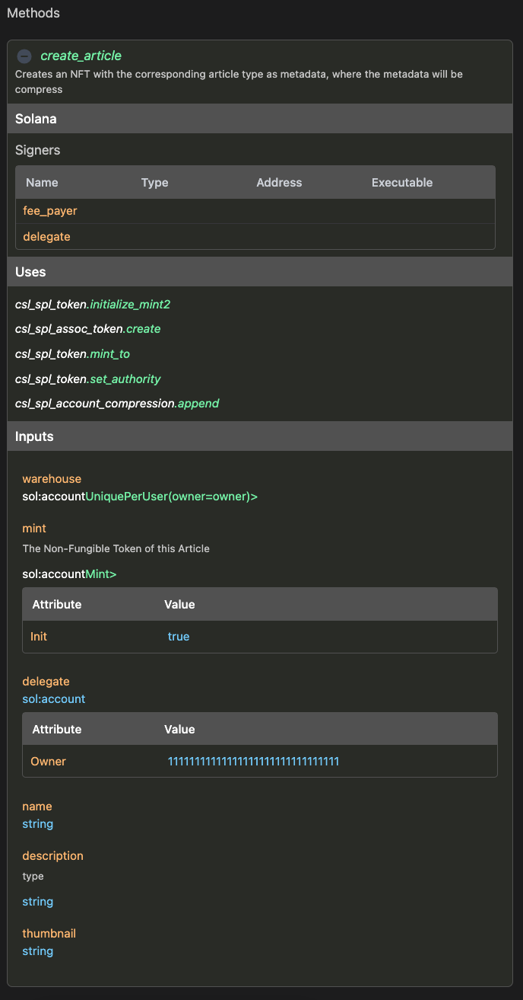

import Tabs from '@theme/Tabs';
import TabItem from '@theme/TabItem';

# Methods

Everything we have learned so far converges on this point... `methods`. The methods are the instruction/endpoints
of our smart contract, the client and other smart contracts will be calling or extending these methods.

:::tip
You can define any number of methods required for your use case.
:::

:::tip
If you are new to the CIDL, we recommend you start learning from understanding what the [CIDL](/learning-the-basics)
:::

## Definition

`methods` is an array of objects where each object is a method

```yaml showLineNumbers
methods:
  - name: create_article
    summary: Creates an NFT with the corresponding article type as metadata, where the metadata will be compress
    solana:
      compress:
        - type: Article
          mode: append
    signers:
      - name: fee_payer
        type: sol:account
        attributes: [ sol:writable ]
      - input: delegate
    uses:
      - csl_spl_token.initialize_mint2
      - csl_spl_assoc_token.create
      - csl_spl_token.mint_to
      - csl_spl_token.set_authority
    inputs:
      - name: warehouse
        type: sol:account<Warehouse, seeds.UniquePerUser(owner=owner)>
      - name: mint
        type: sol:account<csl_spl_token.Mint>
        attributes: [ sol:init ]
        description: The Non-Fungible Token of this Article
      - name: delegate
        type: sol:account
        attributes: [ sol:owner=11111111111111111111111111111111 ]
      - name: name
        type: string
      - name: description
        type: string
      - name: thumbnail
        type: string
```

:::tip
Check the [Inventory guide](../guides/inventory) to learn how to implement methods like the above
:::

| Keyword | Type                                    | Optionality | Description |
|---------|-----------------------------------------|-------------|-------------|
| methods | Array&lt;[MethodBody](#method-body)&gt; | Required    |             |

#### Method Body

| Keyword | Type                                    | Optionality | Description                                                                                                        |
|---------|-----------------------------------------|-------------|--------------------------------------------------------------------------------------------------------------------|
| name    | string                                  | Required    | The name of the method, it must follow the targeted programming naming convention                                  |
| summary | string                                  | Recommended | Documentation summary of the method. Supports markdown                                                             |
| solana  | [Solana](#solana-method-extension)      | Optional    |                                                                                                                    |
| signers | Array&lt;[SignerBody](#signer-body)&gt; | Optional    |                                                                                                                    |
| inputs  | Array&lt;[InputBody](#input-body)&gt;   | Optional    |                                                                                                                    |
| uses    | Array&lt;string&gt;                     | Optional    | List of reference methods in the form of `ref.method_name`, where `ref` is the value set in the [imports](imports) |

##### Solana Method Extension

| Keyword       | Type                                        | Optionality | Description                                                                                                     |
|---------------|---------------------------------------------|-------------|-----------------------------------------------------------------------------------------------------------------|
| default-payer | boolean                                     | Optional    | By default, it is set to `true`. Set to `false` with an empty signer list to remove all signers from the method |
| compress      | Array&lt;[CompressBody](#compress-body)&gt; | Optional    | List of types to be compress.                                                                                   |

###### Compress Body

| Keyword | Type                                                                | Optionality | Description                                                                                                                                                                                    |
|---------|---------------------------------------------------------------------|-------------|------------------------------------------------------------------------------------------------------------------------------------------------------------------------------------------------|
| type    | [Type](custom-types) \| ref.[Type](custom-types)                    | Required    | Can reference imported CIDLs in the form of `ref.type_name`, where `ref` is the value set in the [imports](imports)                                                                            |
| mode    | append \| insert_or_append           \| replace_leaf \| verify_leaf | Required    | How should this type be compress. Each mode corresponds to a method of the [state compression program](https://github.com/Codigo-io/platform/blob/develop/solana/spl_account_compression.yaml) |

###### Signer Body

| Keyword    | Type                                             | Optionality        | Description                                                                                                         |
|------------|--------------------------------------------------|--------------------|---------------------------------------------------------------------------------------------------------------------|
| name       | string                                           | Mutually exclusive | The name for the signing account.                                                                                   |
| type       | [Type](custom-types) \| ref.[Type](custom-types) | Mutually exclusive | Can reference imported CIDLs in the form of `ref.type_name`, where `ref` is the value set in the [imports](imports) |
| input      | string                                           | Mutually exclusive | Reference to an input's name. It will set the input as a signer                                                     |
| attributes | Array&lt;string&gt;                              | Optional           | Attributes to modify/extend the type. Only applicable when type is defined                                          |

:::info
`name`/`type` are mutually exclusive with `input`. This means
that `name`/`type` needs to be set or `input`, both cannot be defined
at the same time.
:::

Defined signers or inputs marked as signers will generate the following security check.

```yaml
methods:
  - name: method_with_custom_signer
    signers:
      - name: fee_payer
        type: sol:account
        attributes: [ sol:writable ]
      - input: delegate
    inputs:
      - name: delegate
        type: sol:account
        attributes: [ sol:owner=11111111111111111111111111111111 ]
```

<Tabs groupId="extension">
  <TabItem value="native" label="Solana Native">

```rust showLineNumbers
pub fn process_method_with_custom_signer(/* ... */) -> ProgramResult {
  // ...
    
  if fee_payer_info.is_signer != true {
    return Err(CounterError::InvalidSignerPermission.into());
  }

  if delegate_info.is_signer != true {
    return Err(CounterError::InvalidSignerPermission.into());
  }
    
  // ...
}
```

  </TabItem>

  <TabItem value="anchor" label="Solana Anchor">

```rust showLineNumbers
#[derive(Accounts)]
pub struct MethodWithCustomSigner<'info> {
  #[account(
    mut,
  )]
  pub fee_payer: Signer<'info>,

  #[account(
    owner=Pubkey::from_str("11111111111111111111111111111111").unwrap(),
  )]
  pub delegate: Signer<'info>,
}
```

  </TabItem>
</Tabs>


##### Input Body

| Keyword     | Type                                                                                                               | Optionality | Description                                                                                                                                                                |
|-------------|--------------------------------------------------------------------------------------------------------------------|-------------|----------------------------------------------------------------------------------------------------------------------------------------------------------------------------|
| name        | string                                                                                                             | Required    | The name of the parameter, it must follow the targeted programming naming convention                                                                                       |
| type        | [native](data-types#native) \| [extended](data-types#extended) \| [Type](custom-types) \| ref.[Type](custom-types) | Required    | The data type of this parameter&lt;br /&gt;&lt;br /&gt;Can reference imported CIDLs in the form of `ref.type_name`, where `ref` is the value set in the [imports](imports) |
| description | string                                                                                                             | Recommended | Documentation of the input. Supports markdown                                                                                                                              |
| attributes  | Array&lt;string&gt;                                                                                                | Optional    | Attributes to modify/extend the type                                                                                                                                       |

:::info
We can specify any native, extended, or custom data type to the input type.
:::

## Web-based documentation

The `methods` object can be visualized in the CIDL web-based doc. The documentation is automatically generated from our
vscode-codigo extension.

[//]  # (This CIDL web-based doc can be generated by typing the command:)

[//]  # (```shell)

[//]  # (codigo solana generate ./counter.cidl --doc)

[//]  # (```)



## Next steps

**Congratulations!** 🎉👏 at this point, you should have a basic understanding of the CIDL, how to work with
native, extended, and custom-defined types, and import other CIDL and implement methods. The next step on your
journey is to start implementing use cases. You can follow our guides to start implementing use cases step by step
or check our examples [here](https://github.com/Codigo-io/platform/tree/develop/examples)

- [Lender guide](../guides/lender.md)
- [Inventory guide](../guides/inventory.md)
- [State compression guide](../guides/state-compression.md)
- [Solana NFT guide](../guides/solana-nft.md)

## Join the Código community 💚

Código is a growing community of developers. Join us on
**[Discord](https://discord.gg/8XHQGS832k)**
and **[GitHub](https://github.com/Codigo-io)**

