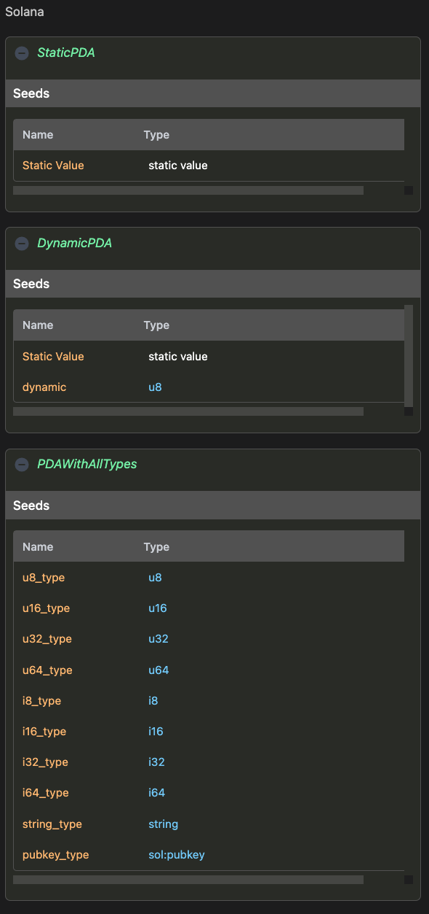

# Solana

One of the main reasons Solana has gained significant traction is the power PDAs bring to building dApps.
The CIDL defines a specific section where a seed definition can be specified.

:::tip
You can define any number of seeds required for your use case.
:::

:::tip
Seeds can be linked to inputs or signers, this ensures us that inputs being received in stubs are used to derive
the PDA. To learn more about this check [Solana Linked Seed Guide](../guides/solana-linked-seeds)
:::

## Definition

`solana` is a key-value object where each key is a definition or configuration specific to Solana. For now,
the only possible definition is `seeds`.

```yaml showLineNumbers
solana:
  seeds:
    StaticPDA:
      items:
        - name: "Static Value"
    DynamicPDA:
      items:
        - name: "Static Value"
        - name: dynamic
          type: u8
    PDAWithAllTypes:
      items:
        - name: u8_type
          type: u8
        - name: u16_type
          type: u16
        - name: u32_type
          type: u32
        - name: u64_type
          type: u64
        - name: i8_type
          type: i8
        - name: i16_type
          type: i16
        - name: i32_type
          type: i32
        - name: i64_type
          type: i64
        - name: string_type
          type: string
        - name: pubkey_type
          type: sol:pubkey
```

| Keyword | Type                       | Optionality | Description |
|---------|----------------------------|-------------|-------------|
| solana  | [SolanaBody](#solana-body) | Optional    |             |

##### Solana Body

| Keyword | Type                                                    | Optionality | Description |
|---------|---------------------------------------------------------|-------------|-------------|
| seeds   | Map&lt;[SeedKey](#seed-key), [SeedBody](#seed-body)&gt; | Optional    |             |

#### Seed Key

Seed name `<seed-name>` must comply with the targeted programming language. The Seed
name is the key to the seed object map, and is used to identify the seed definition within the method definition.

#### Seed Body

The seed body object defines additional keywords to describe the seed

| Keyword | Type                                | Optionality | Description                                                                |
|---------|-------------------------------------|-------------|----------------------------------------------------------------------------|
| items   | Array&lt;[ItemBody](#item-body)&gt; | Required    | An array of items through which we can define the static and dynamic seeds |

##### Item Body

An item that is part of the seeds array. An item can be a literal static value or a dynamic value. Dynamic value are
set
on runtime.

| Keyword     | Type                                                           | Optionality | Description                                                                                                                                             |
|-------------|----------------------------------------------------------------|-------------|---------------------------------------------------------------------------------------------------------------------------------------------------------|
| name        | string                                                         | Required    | A literal value or a variable for when the item is dynamic. If the item is dynamic the variable name must comply with the targeted programming language |
| type        | [native](data-types#native) \| [extended](data-types#extended) | Optional    | The seed type of this property.                                                                                                                         |

## Web-based documentation

The `solana` object can be visualized in the CIDL web-based doc. The documentation is automatically generated from our
vscode-codigo extension.

[//]: # (This CIDL web-based doc can be generated by typing the command:)

[//]: # (```shell)

[//]: # (codigo solana generate ./counter.cidl --doc)

[//]: # (```)



## Next steps

You can follow our guides to start implementing use cases step by step
or check our examples [here](https://github.com/Codigo-io/platform/tree/develop/examples)

- [Lender guide](../guides/lender.md)
- [Inventory guide](../guides/inventory.md)
- [State compression guide](../guides/state-compression.md)
- [Solana NFT guide](../guides/solana-nft.md)

## Join the Código community 💚

Código is a growing community of developers. Join us on
**[Discord](https://discord.gg/8XHQGS832k)**
and **[GitHub](https://github.com/Codigo-io)**

