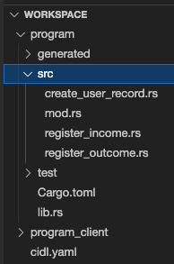

# Quickstart

In this Quickstart guide, you’ll learn how to start with Código’s Interface Description Language (CIDL) from scratch
using our web-based IDE, [Código Studio](https://studio.codigo.ai). Código Studio has all the necessary tools and
programs to develop using the CIDL.

After completing this QuickStart, you should have a basic understanding of the CIDL structure, how to execute Código’s
AI Generator, implement the smart contract business logic, and integrate the generated TypeScript client library. For
this guide, we will target the Solana blockchain.

**Let’s get started!**

## 1. Define the smart contract interface

Open [Código Studio](https://studio.codigo.ai)

When you first open Código Studio, you will see in the explorer a file called `cidl.yaml` with the following content:

```yaml showLineNumbers
cidl: "0.8"
info:
  name: budget_tracker
  title: Budget Tracker
  version: 0.0.1
  summary: |-
    The purpose of this contract is to track the income and outcome of a given user. For this contract, we are going to 
    target the Solana blockchain. Thus, we define the data structure **Record** that will be transpile to a PDA Account 
    base on the seeds defined in the solana extension. In addition, the contract defines three methods, also known as 
    instruction; through this method, we add behavior.

    Some useful links:

      - [Blockchain Extensions](https://docs.codigo.ai/category/blockchain-extensions)
      - [Learning the Basics](https://docs.codigo.ai/código-interface-description-language/learning-the-basics)
      - [Building Solana Programs with CIDL: A Comprehensive Guide Part I](https://docs.codigo.ai/guides/part-1-building-solana-programs)
  contact:
    name: Código
    web: https://codigo.ai
    email: support@codigo.ai
    git: https://github.com/Codigo-io/examples
  license:
    name: MIT
    url: https://opensource.org/license/mit
types:
  Record:
    summary: Through this data structure we will store the relevant information to track the income and outcome of a given user.
    solana:
      owner: self
      seeds:
        - name: record
        - name: signer
          type: sol:pubkey
    fields:
      - name: name
        type: string
        solana:
          attributes: [ cap:50 ]
        description: The name of the user.
      # TODO: 1 - Complete the definition of the Record data structure
      # Add the following fields
      #   - moves of type u16
      #   - outcome of type u32
      #   - income of type u32
      #   - total_balance of type i64
methods:
  - name: create_user_record
    summary: To call once per account. Initialize a Record account. The total_balance of the account will be set to 0.
    inputs:
      - name: user_record
        type: Record
        solana:
          attributes: [ init_if_needed ]
      - name: user_name
        type: string
        description: The username to be assigned to the Record.name property

  # TODO: 2 - Define the register_income method
  #  - Add the following inputs
  #  - record of type Record, and the attribute mut
  #  - amount of type u32

  # TODO: 3 - Define the register_outcome method
  #  - Add the following inputs
  #  - record of type Record, and the attribute mut
  #  - amount of type u32
```

The CIDL contains three TODOs for you to complete. But before you start working on the TODOS, let's talk about some CIDL
basics.

- The CIDL is the input for Código’s Generator. We use the CIDL to define the interfaces of a smart contract.
- The generator requires some general information about the contract; we define these data in the `info` section.
- The `methods` are the instructions of the smart contract; through the methods, we add behavior.
- We can define custom data structure; this can be done within the `types` object.
- The CIDL is blockchain agnostic. With one CIDL, we can target multiple blockchains. For this QuickStart, we targeted
  the Solana Blockchain.
- We can extend the capabilities of a type, field, method, and input through extensions. Because we are targeting the
  Solana Blockchain, we define the solana extension in various places of the CIDL.

With this basic knowledge and the description for each TODO, you should be able to complete them.

**Happy Coding!**

<details>
  <summary>Solution: Complete the definition of the Record data structure</summary>

```yaml showLineNumbers
- name: moves
  type: u16
  description: Number incomes/outcomes registered.
- name: outcome
  type: u32
  description: Sum of all outcomes.
- name: income
  type: u32
  description: Sum of all incomes.
- name: total_balance
  type: i64
  description: The current balance of the user
```

</details>

<details>
  <summary>Solution: Define the register_income method</summary>

```yaml showLineNumbers
- name: register_income
  summary: Register the given amount as an income for the given record account. The total total_balance of the account will be increased.
  inputs:
    - name: user_record
      type: Record
      solana:
        attributes: [ mut ]
    - name: amount
      type: u32
      description: The amount to be registered as the income.
```

</details>

<details>
  <summary>Solution: Define the register_outcome method</summary>

```yaml showLineNumbers
- name: register_outcome
  summary: Register the given amount as an outcome for the given record account. The total total_balance of the account will be decreased.
  inputs:
    - name: user_record
      type: Record
      description: The user record account
      solana:
        attributes: [ mut ]
    - name: amount
      type: u32
      description: Number to be added to the outcome accumulator
```

</details>

## 2. Execute Código Generator

Congratulations on completing the TODOs. With the CIDL completed, we can generate the smart contract and TypeScript
library. For that, open a new terminal; Terminal -> New Terminal

|  |
|:------------------------------------------------------------:|
|                        *New Terminal*                        |

Type the following command to execute the generator: `codigo solana generate cidl.yaml`

When it completes generating the code, you will see three new directories in the explorer as follows:

|  |
|:----------------------------------------------------------:|
|                       *Directories*                        |

- `program` this directory contains all the files for a native solana contract and the stubs where we will implement
  the business logic.
- `program_client` this directory will contain all the files for the TypeScript client library.

## 3. Implement the business logic

When we expand the `program` directory, we will see numerous files corresponding to a native solana smart contract; we
don’t need to change anything on these files; thus, we can ignore them. The files we are interested in and where we will
implement the business logic are inside the `src` directory.

|  |
|:-----------------------------------------------------------------:|
|                         *Stub Directory*                          |

If we open one of those files, we will see a function with the same name as the file. Each file corresponds to a method
defined in the CIDL. Inside each file, we can see a function where we will be implementing the business logic, the
parameters of the function are determined by the inputs define for the method in the CIDL.

### 3.1 Implement `create_user_record`

Open the file `program/src/create_user_record.rs` and replace the comment<br />`// Implement your business logic here...`
with the following line:

```rust showLineNumbers
user_record.data.name = user_name;
```

### 3.2 Implement `register_income`

Open the file `program/src/register_income.rs` and replace the comment<br />`// Implement your business logic here...`
with the following line:

```rust showLineNumbers
user_record.data.moves += 1;
user_record.data.income += amount;
user_record.data.total_balance += amount as i64;
```

### 3.3 Implement `register_outcome`

Open the file `program/src/register_outcome.rs` and replace the comment<br />`// Implement your business logic here...`
with the following line:

```rust showLineNumbers
user_record.data.moves += 1;
user_record.data.outcome += amount;
user_record.data.total_balance -= amount as i64;
```

Congratulations! After implementing seven lines of business logic code, you have a secure working solana contract. The
next step is to build and deploy it!

## 4. Build and deploy the smart contract

Código Studio comes with all the tools and programs for building and deploying smart contracts.

First, let’s build the contract. Open a new terminal by going to Terminal -> New Terminal. Navigate to the `program`
directory by typing the command `cd program`, and inside the `program` directory, type the following command:

```shell
cargo build-sbf
```

This command will take a few seconds to complete. When the previous command completes, open another terminal by going to
Terminal -> New Terminal. In the new terminal, type the command:

```shell
solana-test-validator
```

This command will start a solana validator to where we will be able to deploy the contract. Keep the terminal open so
the validator continues running. Finally, return to the terminal where you built the contract and type the command:

```shell
solana program deploy target/deploy/budget_tracker.so
```

This command will deploy the built contract to the local solana validator we ran in the previous step. When the command
completes, it will return the _Program Id_ of the contract and save it for later.

## 5. Integrate the TypeScript client library

Wow! We have built and deployed a Solana smart contract in just a few minutes. The last step is to use this smart
contract from our application. For this QuickStart, our application will be a command line interface.

Create a new file inside the `program_client` directory named `app.ts`. The file's content is the following:

:::tip
Copy and paste your program ID in line 20 of the app.ts file.
:::

```typescript showLineNumbers
import {Connection, Keypair, PublicKey} from "@solana/web3.js";
import * as fs from "fs/promises";
import * as path from "path";
import * as os from "os";
import {
  createUserRecordSendAndConfirm,
  deriveRecordPDA,
  getRecord,
  initializeClient,
  registerIncomeSendAndConfirm,
  registerOutcomeSendAndConfirm
} from "budget_tracker";
import * as console from "console";

async function main(feePayer: Keypair) {
  const connection = new Connection("http://127.0.0.1:8899", {
    commitment: "confirmed"
  });
  // TODO: Paste your ProgramId HERE
  const progId = new PublicKey("YOUR_PROGRAM_ID");

  initializeClient(progId, connection);

  /**
   * 0. Derive Record PDA to retrieve from Blockchain
   */
  const [recordPub] = deriveRecordPDA({
    index: 0,
    signer: feePayer.publicKey,
  }, progId);

  /**
   * 1. Create a user record, logs the state of the account after creating it
   */
  await createUserRecordSendAndConfirm({
    userName: "John Doe",
    userRecordSeedIndex: 0,
    signers: {
      feePayer
    }
  });
  let record = await getRecord(recordPub);
  console.info(record);

  /**
   * 2. Registered a new income with a value of 100
   */
  await registerIncomeSendAndConfirm({
    amount: 100,
    userRecordSeedIndex: 0,
    signers: {
      feePayer
    }
  });
  record = await getRecord(recordPub);
  console.info(record);

  /**
   * 3. Registered a new outcome with a value of 50
   */
  await registerOutcomeSendAndConfirm({
    amount: 50,
    userRecordSeedIndex: 0,
    signers: {
      feePayer
    }
  });
  record = await getRecord(recordPub);
  console.info(record);
}

fs.readFile(path.join(os.homedir(), ".config/solana/id.json"))
        .then(file => main(Keypair.fromSecretKey(new Uint8Array(JSON.parse(file.toString())))));
```

Finally, execute the `app.ts` file. Open a new terminal by going to Terminal -> New Terminal. Navigate to the sdk
directory `cd program_client`; install the node dependencies executing the command `yarn install`, and install the dev
dependency ts-node executing the command `yarn add -D ts-node`. Finally, execute the file using the following command:

```shell
npx ts-node app.ts
```

If everything went Ok, you should see the following output:

```shell
{
  name: 'John Doe',
  moves: 0,
  outcome: 0,
  income: 0,
  totalBalance: 0n
}
{
  name: 'John Doe',
  moves: 1,
  outcome: 0,
  income: 100,
  totalBalance: 100n
}
{
  name: 'John Doe',
  moves: 2,
  outcome: 50,
  income: 100,
  totalBalance: 50n
}
``` 

## 6. Next steps

**Congratulations!** 🎉👏 you just created your first Solana smart contract using the CIDL and integrated the generated
TypeScript client library with an application. To summarize what we learned:

- CIDL stands for Código Interface Description Language, and it is the input for Código’s AI Generator.
- After completing the CIDL, developers only need to concentrate on implementing the business logic of the smart
  contract. 100% of the client libraries and smart contracts boilerplate are automatically generated.
- Código Studio has all the tools and programs to develop smart contracts using the CIDL.

These links may help you on your journey to writing smart contracts with the CIDL:

- [Overview](./overview.md)
- [Learning the Basics](./código-interface-description-language/learning-the-basics)
- [Part I - Building Solana Programs](./guides/part-1-building-solana-programs)

## Join the Código community 💚

Código is a growing community of developers. Join us on
**[Discord](https://discord.gg/8XHQGS832k)**
and **[GitHub](https://github.com/Codigo-io)**

#### Documentation detectives wanted! If you've spotted any gaps or have suggestions to level up our documentation game, we'd love to hear from you!

[![Button Example]][Link]
[Link]: https://docs.google.com/forms/d/e/1FAIpQLSf94Rm0XwNrU0Wdq63G8ucH8XEHH1ecOJARNGnxQcyqTtz80A/viewform
[Button Example]: https://img.shields.io/badge/Feedback-FD971F?style=for-the-badge


<!-- Let's discover **Codig Studio in less than 5 minutes**.

## Getting Started

Get started by **creating a new site**.

Or **try Docusaurus immediately** with **[docusaurus.new](https://docusaurus.new)**.

### What you'll need

- [Node.js](https://nodejs.org/en/download/) version 16.14 or above:
  - When installing Node.js, you are recommended to check all checkboxes related to dependencies.

## Generate a new site

Generate a new Docusaurus site using the **classic template**.

The classic template will automatically be added to your project after you run the command:

```bash
npm init docusaurus@latest my-website classic
```

You can type this command into Command Prompt, Powershell, Terminal, or any other integrated terminal of your code editor.

The command also installs all necessary dependencies you need to run Docusaurus.

## Start your site

Run the development server:

```bash
cd my-website
npm run start
```

The `cd` command changes the directory you're working with. In order to work with your newly created Docusaurus site, you'll need to navigate the terminal there.

The `npm run start` command builds your website locally and serves it through a development server, ready for you to view at http://localhost:3000/.

Open `docs/intro.md` (this page) and edit some lines: the site **reloads automatically** and displays your changes. -->
